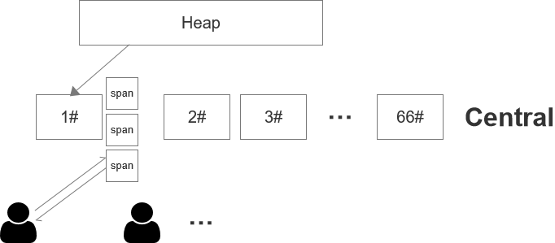

# 内存分配

对于Go的内存分配器来讲，它有一些处理会比较麻烦，因为要支持并发，分配的时候就会有一堆人去抢。这时候我们考虑的可能是分配的时候给每个人一个相对大块的内存来减少分配的次数，也就相应的减少了竞争的次数。就像是分一个饼，一块块的分而不是一口口的吃，抢的次数就少了。同时还要考虑不用的内存需要回收以复用的问题，我们可以用钢铁厂做个比方。每个人都需要用钢铁做东西，他们的用途可能不太相同，有人拿来做刀，有人拿来做剑，有人拿来做棍棒，有人拿来既做刀又做剑。面对这种情况，我们直接把钢铁厂的钢铁给用户自己去做就不太合适了，就需要在中间加一层生产商更合理。

这样做的好处是原本需要都去钢铁厂竞争做这把刀的用户，现在在制刀厂竞争了，而且若是一个用户做剑、另一个用户做棍，现在则没有冲突了。商品生产商这一层分散了竞争效应，原本的一个锁变成了n个锁。同时仍然可以一次买10把刀，来减少和其他人抢的概率，这10把刀可以用来接着分配就没有人会来抢，当然这里会有一定的浪费，属于空间换时间的做法。

垃圾回收的时候，如果10把刀我只用了2把，剩下的8把就可以返还给制刀厂，给其他人用。这实现了一级平衡，即在相同类型之间的平衡。也有可能由于种种原因出现刀冗余非常多的情况，这时候就可以把刀给钢铁厂全部熔了做其他东西，这属于二级平衡，在材料上的平衡。

通过这三层结构，我们实现了二级平衡，达到了一定程度上的复用效果。那么需要多少种商品生产商呢？不可能因为每个人需求不同就给设定相应的商品生产商，我们需要对商品进行分类。对于内存分配器来说，它关心的是商品大小，先以32KB为界，把对象分为大对象和小对象。对于大于32KB的大对象，分配和回收都进行特殊对待，用户代码中大对象往往很少。对于小对象，我们按照8字节对齐，分为66种SizeClass，例如8字节、16字节、32字节、48字节等等，例如对于1个9字节的对象，就会给它分配16字节，这可能会造成一定的空间浪费，但不至于产生过多的内存碎片。

现在，我们可以把钢铁厂叫堆(Heap)，它向操作系统申请内存，负责管理原始材料。这66种商品生产商我们称为中间对象(Central)。再下面的人属于具体分配的，我们称为(Cache)，其实它就是缓存了一大批需要的东西接下来用于分配。我们把每块从操作系统拿的内存叫做Span，假设把它按照规格2即16字节来切分，就会形成了若干个小块，每个小块我们称为Object。现在变成了这样:

每个central分配的时候给的是一个切好了的span，每个cache还的时候也是还整个span，即使其中有部分object被用掉了也只是标记一下。

接着还有一些问题没有解决，第一是操作系统虚拟地址分配的问题。我们希望是在某个固定的段之内紧凑的进行内存分配来避免内存碎片化。这样我们就需要先提前占用一段内存空间，做为保留空间，并不进行实际的分配动作，我们把这段空间叫arena。那么如何在进程中找到这样一段连续的地址空间呢？首先向操作系统申请内存，操作系统必然会给一个可用的虚拟内存地址；然后尝试按这个地址向右扩张，如果右边被堵住了就向左边扩张；如果两边都被堵住了就再次向操作系统申请内存，尝试向右向左扩张的操作。64位地址空间还是比较大的，往往容易找到这样一段空间。

第二是每个span还需要位图(bitmap)来标记哪些是可用的，我们所说的切分object也只是理解上的切分，实际上我们要找到一个可用的object，就是用这个span的起始地址加上位图中可用对象的偏移量乘以SizeClass的大小，即base+offset*size。

第三，我们还需要一个反查表，它记录了每个span的起始地址，为什么需要这样一个表呢？假设某个span里面有100个object，我们只需要其中的10个object，我们就可用通过反查表把这个span一分为二，把剩余的90个object组成的span拿回来。拿回来之后还能通过反查表检查它左右相邻的span是不是闲置的，如果闲置则可把他们合并为一个大的块。所以span块大小可能不是固定的，根据需要可能会切分或合并。

那么整个过程是这样的，首先堆Heap向操作系统申请64MB内存，操作系统是机会主义的分配，实际上拿到的64MB的期货，之后以页为单位写时分配物理内存。分配之后就有一大堆的span需要去管理，Heap采用了树堆结构去管理。树堆相当于树的数据结构，增加了一些堆的特性，排序按照地址来排序。使用树堆去分配给central，总是尽可能分配到一个大小合适而且地址靠前的span，因为地址靠前使得内存相对来说更紧凑。central拿到之后也只是做一些属性的设置，重置一下span的位图等。cache通常会和P绑定，M需要内存的时候就去找P拿，P再找cache，cache再找central。所以cache内会有一个数组，数组内容是以SizeClass为索引的span。P/M在cache上分配内存时是无锁的。例如用户若需要一个7字节大小的内存，计算得出对应的SizeClass是1#，就会通过P/M去cache[1]中看有没有span，没有就去central中拿，如果已经有了就去看这个span的位图中有没有空余的空间。而如果用户需要一个大于32KB的大对象，则central直接去堆上拿即可。

小对象中有两种特殊的对象，一种是长度为0的对象，另一种是微小对象。对于长度为0的对象，比如空结构体，我们不应该为其分配内存，但得给它们一个合理合法的地址。Go专门有一个全局变量叫ZeroBase，不管是什么对象，只要它长度为0就会去指向这个全局变量的地址。


// base address for all 0-byte allocations
var zerobase uintptr

func mallocgc(size uintptr, typ *_type, needzero bool) unsafe.Pointer {
	if gcphase == _GCmarktermination {
		throw("mallocgc called with gcphase == _GCmarktermination")
	}

	if size == 0 {
		return unsafe.Pointer(&zerobase)
	}
    ...
}


微小对象属于分配中比较常见的，例如短字符串等。如果发现需要分配一批微小对象，会从一个2#的span中提取出一个object(16字节)，记录它并把多个微小对象都放进去，有助于节约内存。但是这些微小对象中不能有指针，因为它不能去引用其他地方，这样垃圾回收器才会把它当做一个整体去扫描。