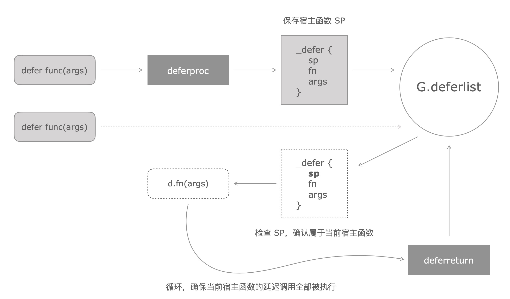

# Defer延迟调用

defer是GO语言中独有的特性，在其他语言中可能采用`try...finally`这样的方式来实现，两者还是有很大区别的。finally是立即执行的，而defer会延迟执行，且defer可以分割很多的逻辑。延迟调用最大的优势是即便函数执行出错，依然能保证回收资源等操作得以执行。

我们看到很多的文章中是这样描述defer执行方式的，参数首先会被复制进`defer func`中，然后执行原函数，然后执行`defer func`，最后再执行return。那么真的是这样么？这似乎解释不了如下示例:
```
func test1() int {
	x := 100
	defer func() {
		x++
	}()
	return x
}

func test2() (x int) {
	x = 100
	defer func() {
		x++
	}()
	return 100
}

func main() {
	println("test1:", test1())
	println("test2:", test2())
}

[ubuntu] ~/.mac $ go run test.go
test1: 100
test2: 101
```

按照这个观点，似乎test1()的执行过程应该是x等于100，然后x++，然后返回x=101；test2()应该是x等于100，然后x++，然后返回100。但执行结果却都和我们预想的不一样，带着这样的疑问，我们来深入了解defer的执行机制。

我们先来看一个简单的例子:
```
func test(a, b int) {
	println("test: ", a, b)
}
func main() {
	a, b := 0x11, 0x22
	defer test(a, b)
	a++
	b++
	println("main: ", a, b)
}
```

然后反汇编看看它的执行过程:
```
[ubuntu] ~/.mac $ go build test.go
[ubuntu] ~/.mac $ go tool objdump -s "main\.main" test
TEXT main.main(SB) /root/.mac/test.go
  test.go:6		0x4523b0		64488b0c25f8ffffff	MOVQ FS:0xfffffff8, CX
  test.go:6		0x4523b9		483b6110		CMPQ 0x10(CX), SP
  test.go:6		0x4523bd		0f86ad000000		JBE 0x452470
  test.go:6		0x4523c3		4883ec58		SUBQ $0x58, SP
  test.go:6		0x4523c7		48896c2450		MOVQ BP, 0x50(SP)
  test.go:6		0x4523cc		488d6c2450		LEAQ 0x50(SP), BP
  test.go:8		0x4523d1		c744241010000000	MOVL $0x10, 0x10(SP)
  test.go:8		0x4523d9		488d05705a0200		LEAQ 0x25a70(IP), AX
  test.go:8		0x4523e0		4889442428		MOVQ AX, 0x28(SP)
  test.go:8		0x4523e5		48c744244011000000	MOVQ $0x11, 0x40(SP)
  test.go:8		0x4523ee		48c744244822000000	MOVQ $0x22, 0x48(SP)
  test.go:8		0x4523f7		488d442410		LEAQ 0x10(SP), AX
  test.go:8		0x4523fc		48890424		MOVQ AX, 0(SP)
  test.go:8		0x452400		e87b16fdff		CALL runtime.deferprocStack(SB)
  test.go:8		0x452405		85c0			TESTL AX, AX
  test.go:8		0x452407		7557			JNE 0x452460
  test.go:11		0x452409		e8a230fdff		CALL runtime.printlock(SB)
  test.go:11		0x45240e		488d0583130200		LEAQ 0x21383(IP), AX
  test.go:11		0x452415		48890424		MOVQ AX, 0(SP)
  test.go:11		0x452419		48c744240807000000	MOVQ $0x7, 0x8(SP)
  test.go:11		0x452422		e8c939fdff		CALL runtime.printstring(SB)
  test.go:11		0x452427		48c7042412000000	MOVQ $0x12, 0(SP)
  test.go:11		0x45242f		e8fc37fdff		CALL runtime.printint(SB)
  test.go:11		0x452434		e8b732fdff		CALL runtime.printsp(SB)
  test.go:11		0x452439		48c7042423000000	MOVQ $0x23, 0(SP)
  test.go:11		0x452441		e8ea37fdff		CALL runtime.printint(SB)
  test.go:11		0x452446		e8f532fdff		CALL runtime.printnl(SB)
  test.go:11		0x45244b		e8e030fdff		CALL runtime.printunlock(SB)
  test.go:12		0x452450		90			NOPL
  test.go:12		0x452451		e82a1cfdff		CALL runtime.deferreturn(SB)
  test.go:12		0x452456		488b6c2450		MOVQ 0x50(SP), BP
  test.go:12		0x45245b		4883c458		ADDQ $0x58, SP
  test.go:12		0x45245f		c3			RET
  test.go:8		0x452460		90			NOPL
  test.go:8		0x452461		e81a1cfdff		CALL runtime.deferreturn(SB)
  test.go:8		0x452466		488b6c2450		MOVQ 0x50(SP), BP
  test.go:8		0x45246b		4883c458		ADDQ $0x58, SP
  test.go:8		0x45246f		c3			RET
  test.go:6		0x452470		e82b7affff		CALL runtime.morestack_noctxt(SB)
  test.go:6		0x452475		e936ffffff		JMP main.main(SB)
```

我们发现`defer test(a, b)`实际上会被转化为`CALL runtime.deferproc(SB)`（Go1.13才使用deferprocStack，这里先以deferproc为例），之后进行的`a++`已经不会影响到它，而在main函数执行完之后，才会去通过`CALL runtime.deferreturn(SB)`调用它。

我们再来看看`runtime.deferproc`干了些什么，我在这里也把源码中重要的注释翻译了过来:

```
// go/src/runtime/panic.go
// siz表示fn方法中参数需要占用多少个字节，使用siz创建了一个deferred的方法fn
// 编译器将一个defer语句转化为一个对此方法的调用
func deferproc(siz int32, fn *funcval) {  // fn之后紧跟着fn的参数
	if getg().m.curg != getg() {
		throw("defer on system stack")
	}
    
  //fn的参数处于一个危险的状态，deferproc的stack map并没有复制它们。所以我们不能让垃圾回收器或者栈复制触发，直到我们把这些参数复制到一个安全的地方。下面的内存复制会做到这一点。在复制完成前，我们只能调用nosplit routines。
	sp := getcallersp()
	argp := uintptr(unsafe.Pointer(&fn)) + unsafe.Sizeof(fn)
	callerpc := getcallerpc()

	d := newdefer(siz)
	if d._panic != nil {
		throw("deferproc: d.panic != nil after newdefer")
	}
	d.fn = fn
	d.pc = callerpc
	d.sp = sp
	switch siz {
	case 0:
		// Do nothing.
	case sys.PtrSize:
		*(*uintptr)(deferArgs(d)) = *(*uintptr)(unsafe.Pointer(argp))
	default:
		memmove(deferArgs(d), unsafe.Pointer(argp), uintptr(siz))
	}
	return0()
}
```

我们发现newdefer函数返回的是一个这样的结构体:
```
// go/src/runtime/runtime2.go
type _defer struct {
	siz     int32 // includes both arguments and results
	started bool
	heap    bool
	openDefer bool
	sp        uintptr  // sp at time of defer
	pc        uintptr  // pc at time of defer
	fn        *funcval // can be nil for open-coded defers
	_panic    *_panic  // panic that is running defer
	link      *_defer

	fd   unsafe.Pointer // funcdata for the function associated with the frame
	varp uintptr        // value of varp for the stack frame

	framepc uintptr
}
```

鉴于篇幅，我删除了其注释，但可根据这些注释得出结论，`defer func()`这个语句会被保存在当前Goroutine中，把它的参数、所需要的栈大小等保存为一个_defer对象，把多个_defer形成一个链表，也就是一个FILO的队列。

但是Goroutine和函数执行没什么直接的关系，如果是A嵌套B，B嵌套C，A、B、C都有各自的defer语句，那么它们都会被保存在这个Goroutine的_defer链表中，它怎么保证执行C的时候不把B的defer执行掉，这个秘密藏在`CALL runtime.deferreturn(SB)`中:

```
func deferreturn(arg0 uintptr) {
	gp := getg()
	d := gp._defer
	if d == nil {
		return
	}
	sp := getcallersp()
	if d.sp != sp {
		return
	}
	if d.openDefer {
		done := runOpenDeferFrame(gp, d)
		if !done {
			throw("unfinished open-coded defers in deferreturn")
		}
		gp._defer = d.link
		freedefer(d)
		return
	}

	switch d.siz {
	case 0:
		// Do nothing.
	case sys.PtrSize:
		*(*uintptr)(unsafe.Pointer(&arg0)) = *(*uintptr)(deferArgs(d))
	default:
		memmove(unsafe.Pointer(&arg0), deferArgs(d), uintptr(d.siz))
	}
	fn := d.fn
	d.fn = nil
	gp._defer = d.link
	freedefer(d)
	jmpdefer(fn, uintptr(unsafe.Pointer(&arg0)))
}
```

函数执行调用这个指令的时候，它先拿到当前Goroutine的_defer链表，然后依次检查它的SP就行了，这个SP是执行deferproc时存进去的当前这个函数的栈顶，只要不一致那肯定是父函数的栈了。

回到最初的问题，我们发现反编译之后，函数的整个执行顺序是这样的，函数调用方已经分配好了被调用方的参数和返回值相对于栈顶的地址，然后执行函数，遇到defer语句时先存在Goroutine的_defer链表中接着执行函数，执行完函数后回过头来执行_defer的func，最后调用RET指令并恢复现场。套用到test1()中，就是先定义了返回值(return_val)是个整数并给它了个地址，然后执行x:=100，然后return x被翻译为了return_val=x，然后执行x++，最后调用RET指令。在test2()中，return_val直接叫x，然后给它赋值100，return 100已经没有意义，然后执行return_val_x++，最后调用RET指令。

整个defer的执行核心过程如下图所示:


此外，我们在挖掘源码的时候发现defer是有很多堆上内存分配行为的，这会影响性能。在Go1.13中编译器会判断如果没有发生内存逃逸，就调用`deferprocStack`把_defer对象建在栈上，这个对象的heap属性就是描述它是否在堆上分配的。具体是如何判断的，初步了解是defer func是顶级函数时就分配到栈上，如果它外层有迭代循环之类的将会被分配到堆上，之后再详细了解。