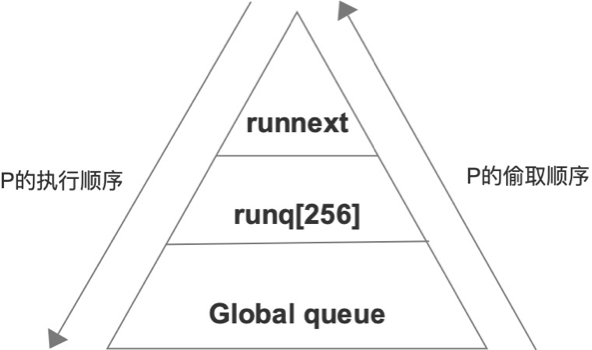

# Go并发调度

背景知识
-------

GO和其他语言不同的就是我们很少在GO中听到多线程的概念，其提供的API中也没有创建线程这种东西。因为这门语言从用户写的第一行代码开始就是并发状态的。

### 并发与并行

**并发**是指多个逻辑可以同时执行，把CPU时间分成不同的时间片段，这些时间片段分配给不同的逻辑，构成一个完整的CPU执行时间序列。
而**并行**是一种特殊的并发，不同逻辑由于CPU的多核，分配在不同的核上可以在物理时间上同时执行。这种状态其实很难实现，因为往往任一操作系统，它本身跑的程序非常多，远大于CPU核数。

### 线程与协程

**线程**是执行单位，相当于工厂里的生产线。操作系统是按线程分配时间片，所以程序的线程越多获得的执行时间也就越长。线程是在系统空间实现的，而**协程**是在用户空间实现的，操作系统根本不知道协程。

比如某个线程上有A、B两个任务，若A有死循环或者A等待网络响应等就会发生B被饿死的情况，为了避免这种情况，A就会主动让给B或者调度器去执行。这就是协程的工作方式，任务之间相互协商，属于协作式多任务系统，通常是在用户空间实现一个框架。而多线程是抢占式调度，不管某个程序会不会主动让出，当前时间片执行完就会被操作系统强迫分给其他线程。

程序等于算法加数据，算法相当于一个解决问题的过程，数据又分为系统数据和用户数据。用户数据保存在用户堆栈上。操作系统为每个线程分配一个栈，大多用来保存局部变量，通常编译期就能确定，运行期通过寄存器访问，无需垃圾回收。而堆内存属于进程，进程内的线程共享，需要运行期动态分配以及垃圾回收。

运行时
-------

现代的编程语言创建一个线程往往是使用一个标准库或者第三方库提供API的，分配内存也往往会向操作系统提前申请一大块内存，通过这样一层抽象来减少用户态和内核态的切换来提升效率，我们把这层抽象叫做**runtime**（运行时）。它就像一个弱化版的操作系统，可以针对用户空间内的代码，结合当前语言的特性做大量的优化。

Go运行时第一个抽象出的概念就是P（Processor），相当于处理器。物理上有多少个CPU、有多少个核，runtime并不关心，它是在OS上的一层抽象，os才是在硬件的上一层抽象。runtime认为在当前的环境内只有一个程序，所以我们可以通过P来设定并发的数量，同时能执行这个程序内的多少个并发任务。

第二个抽象是M（Machine），对应了一个系统线程，是对线程的包装，也就是说P控制了同时有多少个M在执行。它是实际执行体，和P绑定，以调度循环方式不断执行G并发任务。

第三个抽象就是G（Goroutine），实际上就是任务载体，或者说资源包，包括了函数地址，需要的参数，所需的内存。当我们使用`go func(){}()`时，实际上就是创建了一个G对象。

为什么G需要内存，按说M相当于线程也就应该有了栈内存？实际上它们都有自己的内存，G中的内存为G.stack（默认大小2KB），M中的内存为G0。G在M上运行，就像是列车在线路上运行，线路本身也需要去投入资源维护。而把两块内存分开，是因为M所需的内存比较连续、相对固定、逻辑完整，G却会因为各种各样的原因或者异常可能会调度到别的M上去。

*G、M、P共同构成了多任务并发执行的基本模式，P用来控制同时有多少个并发任务执行，M对应到某个线程，G代表了go func语句翻译的一个任务包，最终还得有个调度器统合起来，把G放到合适的M上去执行。*

任务平衡
-------

### 正向分析

当我们在一个for循环中创建了成千上万个并发任务时，它们并不是立即执行的，而是打包成一个个G对象保存在两个队列中（P本地队列和G全局队列）。

假设当前只有4个P，在main函数执行的时候就需要一个P1/M1绑定体，main中创建的其他go func就会打包成G对象放在P1.queue中。也就是说任一M内创建的G都会保存在当前这个P的本地队列中，为什么不能放在P2、P3、P4的队列中？放在别的队列就需要去判断这个P是不是闲置的，还可能需要加锁等等，会变得很复杂。

那么如果在main中创建了1000个G，它们就得等P1/M1中当前的任务执行完了才会得到执行，可能P2、P3、P4都是闲置的，这明显不合理。如何在多个P之间去平衡任务呢？使用了两种方法，一种是规定了每个P本地队列只能放256个G，一次放的过多时会按一定规则比如放一半到全局队列中去；另一种是某个P若闲置了就会在全局队列中去找（可能有很多P都在全局中找，就需要排队去找），找到了就把一部分任务移动到自己的本地队列中，没有找到就会去其他P中偷一部分任务过来，从全局队里或其他P中偷都是需要加锁的，效率相对会低一些。

这样的平衡方式也就决定了我们没有办法确定哪个方法先执行，哪个后执行，除非我们自己写逻辑去判断先后。我们再来看一个关于执行顺序的示例:


func main() {
    runtime.GOMAXPROCS(1) // 设置P为1
    for i := 0; i < 10; i++ {
        go func(id int) { // 创建10个G
            time.Sleep(time.Second)
            fmt.Println(id)
        }(i)
    }
    time.Sleep(time.Second * 2)
}


执行结果:


[ubuntu] ~/.mac/gocode $ go run goroutine.go
9
0
1
2
3
4
5
6
7
8


> 为什么当P为1的时候，它不是顺序输出的，9总是在第一个？  

每个P的本地队列中其实包含两个部分，runnext[1]和runq[256]。当我们每次添加一个任务的时候，它会先放在runnext中，再添加一个任务时，会把新添加的放在runnext，之前添加的放在runq中。runnext总是保留用户最后创建的任务，执行的时候先查runnext去执行。

> 为什么要有runnext的设计？

假设只创建了一个并发任务，也放在runq中让别的P去抢没有必要，而且大多数情况下我们不会去批量创建G；另外若runq既用来P1执行又让P2、P3去偷，那就又会涉及到加锁。

> 那么为什么是G9放在runnext，而不是G0？

因为放在runnext以后我们无法保证还有多少逻辑执行完才轮到它，就可能会runq中的任务都被偷走了且执行完了G0才会执行，这对G0很不公平。

*显然任务被分成了三个性能层次，runnext是完全私有的，runq属于原子操作（原子操作对CPU来讲也是锁，锁的是地址总线），Global属于一定要加mutex锁的，这三个层次产生资源竞争的可能性逐步增大。*

### 逆向分析

在最开始的时候，我们先设计为一个循环队列，它底层结构可能就是一个数组。问题在于，当有多个人去竞争的时候，这个数组就会存在资源竞争效应，我们就会考虑加入锁，显然这种效率是最低的。  

假设现在有3个P/M，我们就可以把一个大的队列拆分成3个小的队列，让每个P/M持有一个私有的队列，这种优化策略使得锁的问题可以解决掉。但也带来新的问题，可能P1已执行完自己的任务，P2、P3还得执行很久，我们可能一开始按任务的数量平均分配至各个私有队列，但有的任务执行时间很长，有的任务很快就能执行完。  

因此，P1应该去P2、P3中拿取任务才是合理的，所有人有义务去完成整个系统的任务。P1直接去拿就会和P2、P3打起来形成竞争效应，第二步的优化策略就是保留一个全局队列，P1可以先去全局队列里找，而P2、P3有很大概率是在本地队列去找的，P1获得锁的概率就会更大，全局队列使得锁的压力被分摊，同时也使得P2、P3中若有多余的任务也可以放进去。 
 
当P1的本地队列已执行完，全局队列中的任务也被执行完时，它就会任选P2或P3，形成直接的竞争。这时候我们考虑的优化策略，就是把本地队列一分为二，上面是runnext用于本地执行，下面是runq[256]用来给P1偷的。

这种结构很像CPU的存储结构，通过分散距离、增加存储层次来减少直接竞争冲突的概率。

调度执行
-------

### P、M解绑

当我们创建一个G的时候，实际上是背后的调度器在当前M上的G0去执行的，它发现有新的任务出现时，会发出一个唤醒信号，去检查有没有P空闲的，以及有没有M是休眠状态的？若P空闲且没有休眠的M，就会去创建一个M对象。所以唤醒操作要有意义，就得有P闲着没事干。

那么M是怎样变为休眠状态的？

当一个P和M绑定之后，它会进入到一个调度程序（Schedule函数），调度程序会去找G对象（按runnext、runq、Global、other P的顺序），找到之后内存由G0上执行切换到G.stack上去执行，执行完成之后进入收尾阶段，清理现场把G当做一个包装对象让它能重复使用。然后重新回到Schedule函数形成一个调度循环。

这个循环可能因为找不到G对象而中断，比如说当前就只有一个任务。那么P和M就会解绑，M会进入休眠状态。

还有一种P和M解绑的情况，比如当前在进行一个系统调用，而这个系统调用花了很长时间，调度器就会把这个P拿走干别的事，而M压根不知道，因为它在内核态，等系统调用结束以后M发现找不到P，那它就没法继续执行，只能把当前的任务状态保存回G.stack，在把执行一半的任务重新放回队列，M再次进入休眠状态，执行一半的任务再下次遇到P/M时接着执行。

这就可能导致一个问题，创建出大量的空闲的M，不会被回收。M是会在操作系统内核中创建一个线程，尽管这种休眠状态下的M不会被CPU分配时间片，但仍然会占用管理资源，另外每个M上都带着G0内存，相当于资源泄漏了。我们通过如下代码来模拟这种情况：


func main(){
    for i :=0;i<1000;i++{
        go func(){
            runtime.LockOSThread() //通过锁模拟系统调用
            defer runtime.UnlockOSThread()
            time.Sleep(time.Second*5)
        }()
    }
    time.Sleep(time.Minute)
}


通过`go build test.go && GODEBUG=schedtrace=1000 ./test`运行：


SCHED 0ms: gomaxprocs=4 idleprocs=2 threads=5 spinningthreads=1 idlethreads=2 runqueue=0 [0 0 0 0]
SCHED 1002ms: gomaxprocs=4 idleprocs=4 threads=1010 spinningthreads=0 idlethreads=4 runqueue=0 [0 0 0 0]
SCHED 2008ms: gomaxprocs=4 idleprocs=4 threads=1010 spinningthreads=0 idlethreads=4 runqueue=0 [0 0 0 0]
SCHED 3013ms: gomaxprocs=4 idleprocs=4 threads=1010 spinningthreads=0 idlethreads=4 runqueue=0 [0 0 0 0]
SCHED 4014ms: gomaxprocs=4 idleprocs=4 threads=1010 spinningthreads=0 idlethreads=4 runqueue=0 [0 0 0 0]
SCHED 5015ms: gomaxprocs=4 idleprocs=4 threads=1010 spinningthreads=0 idlethreads=127 runqueue=0 [0 0 0 0]
SCHED 6017ms: gomaxprocs=4 idleprocs=4 threads=1010 spinningthreads=0 idlethreads=1007 runqueue=0 [0 0 0 0]
SCHED 7025ms: gomaxprocs=4 idleprocs=4 threads=1010 spinningthreads=0 idlethreads=1007 runqueue=0 [0 0 0 0]
SCHED 8027ms: gomaxprocs=4 idleprocs=4 threads=1010 spinningthreads=0 idlethreads=1007 runqueue=0 [0 0 0 0]
SCHED 9029ms: gomaxprocs=4 idleprocs=4 threads=1010 spinningthreads=0 idlethreads=1007 runqueue=0 [0 0 0 0]
SCHED 10031ms: gomaxprocs=4 idleprocs=4 threads=1010 spinningthreads=0 idlethreads=1007 runqueue=0 [0 0 0 0]


我们发现任务开始的时候共创建了1010个线程，任务执行完以后，仍然有1007个休眠的线程。当我们把`runtime.LockOSThread()`注释掉，重新运行：


SCHED 0ms: gomaxprocs=4 idleprocs=1 threads=5 spinningthreads=1 idlethreads=1 runqueue=0 [48 49 133 0]
SCHED 1004ms: gomaxprocs=4 idleprocs=4 threads=9 spinningthreads=0 idlethreads=4 runqueue=0 [0 0 0 0]
SCHED 2008ms: gomaxprocs=4 idleprocs=4 threads=9 spinningthreads=0 idlethreads=4 runqueue=0 [0 0 0 0]
SCHED 3010ms: gomaxprocs=4 idleprocs=4 threads=9 spinningthreads=0 idlethreads=4 runqueue=0 [0 0 0 0]
SCHED 4015ms: gomaxprocs=4 idleprocs=4 threads=9 spinningthreads=0 idlethreads=4 runqueue=0 [0 0 0 0]
SCHED 5026ms: gomaxprocs=4 idleprocs=4 threads=9 spinningthreads=0 idlethreads=7 runqueue=0 [0 0 0 0]
SCHED 6031ms: gomaxprocs=4 idleprocs=4 threads=9 spinningthreads=0 idlethreads=7 runqueue=0 [0 0 0 0]


发现没有系统调用，那就根本不会有那么多线程。我们再把`runtime.LockOSThread()`保留，`defer runtime.UnlockOSThread()`去掉，运行结果如下：


SCHED 0ms: gomaxprocs=4 idleprocs=2 threads=5 spinningthreads=1 idlethreads=2 runqueue=0 [0 0 152 0]
SCHED 1000ms: gomaxprocs=4 idleprocs=4 threads=1010 spinningthreads=0 idlethreads=4 runqueue=0 [0 0 0 0]
SCHED 2001ms: gomaxprocs=4 idleprocs=4 threads=1010 spinningthreads=0 idlethreads=4 runqueue=0 [0 0 0 0]
SCHED 3008ms: gomaxprocs=4 idleprocs=4 threads=1010 spinningthreads=0 idlethreads=4 runqueue=0 [0 0 0 0]
SCHED 4016ms: gomaxprocs=4 idleprocs=4 threads=1010 spinningthreads=0 idlethreads=4 runqueue=0 [0 0 0 0]
SCHED 5019ms: gomaxprocs=4 idleprocs=0 threads=938 spinningthreads=0 idlethreads=4 runqueue=0 [18 1 3 7]
SCHED 6027ms: gomaxprocs=4 idleprocs=4 threads=13 spinningthreads=0 idlethreads=10 runqueue=0 [0 0 0 0]
SCHED 7037ms: gomaxprocs=4 idleprocs=4 threads=13 spinningthreads=0 idlethreads=10 runqueue=0 [0 0 0 0]
SCHED 8042ms: gomaxprocs=4 idleprocs=4 threads=13 spinningthreads=0 idlethreads=10 runqueue=0 [0 0 0 0]
SCHED 9044ms: gomaxprocs=4 idleprocs=4 threads=13 spinningthreads=0 idlethreads=10 runqueue=0 [0 0 0 0]
cSCHED 10047ms: gomaxprocs=4 idleprocs=4 threads=13 spinningthreads=0 idlethreads=10 runqueue=0 [0 0 0 0]


我们发现那些创建的线程是会被回收的，线程没有被解锁意味着线程的状态没有被解除而陷入了死锁状态，线程不能再去接收新的任务没有存在的意义自然会被杀掉。

*综上，我们发现P往往是恒定的，而G和M是可复用的，复用虽然可能造成资源的浪费，但它避免了重新创建时的可能造成的竞争效应。对于一些长期运行的东西，我们需要再创建还是释放之间做一些权衡。*

### 任务饿死

假设当前的P/M正在执行一个G，这时候G里面创建了一个G1，G1会被放到当前P的runnext中，但它可能迟迟得不到执行被饿死，因为G中可能还有大量的逻辑代码执行完才轮到runnext，这显然是不合理的。怎么解决这个问题呢？是否可以让当前这个P/M交替的执行G和G1？P不是真正的CPU，没法实现基于时间片的抢占式调度，只能实现类似于协程那样的协作式调度。很多语言里都使用类似于Gosched()这样的函数来主动交出执行权，但Go中却很少见；还有一种形式是runtime带一个计数器，每执行一个任务后累加计数，当到达一个指定的计数就会被认为是使用完了时间片，向当前执行的P/M发出一个抢占式的信号，然后G主动让出执行权限。Go到底是怎样做的？我们来看如下示例：


// GODEBUG=schedtrace=1000,scheddetail=1 ./test  可查看运行期GMP状态
func main(){
    runtime.GOMAXPROCS(1)
    for i:=0;i<3;i++{
        go func(id int){
            println(id)
            x := 0
            for{  // 死循环
                x++
                //print()
            }
        }(i)
    }
    time.Sleep(time.Second)
}


我们模拟了只有一个P/M，这时候创建了3个G，让第一个G执行的过程中进入死循环，运行结果就是只打印出了任务0，其他G被饿死了。但当我们在死循环内x++后面加入一个函数，则任务0、1、2都会被打印出。问题就出在这个函数上。

我们先使用一个简单的函数来观察：


//go:noinline
func test(){
    println()
}

func main(){
    test()
}


使用`go build && go tool objdump -s "main\.test" test`反汇编：


TEXT main.test(SB) /mnt/hgfs/disk/test.go
  test.go:5		0x4525b0		64488b0c25f8ffffff	MOVQ FS:0xfffffff8, CX			
  test.go:5		0x4525b9		483b6110		CMPQ 0x10(CX), SP			
  test.go:5		0x4525bd		7624			JBE 0x4525e3				
  test.go:5		0x4525bf		4883ec08		SUBQ $0x8, SP				
  test.go:5		0x4525c3		48892c24		MOVQ BP, 0(SP)				
  test.go:5		0x4525c7		488d2c24		LEAQ 0(SP), BP				
  test.go:6		0x4525cb		e80031fdff		CALL runtime.printlock(SB)		
  test.go:6		0x4525d0		e88b33fdff		CALL runtime.printnl(SB)		
  test.go:6		0x4525d5		e87631fdff		CALL runtime.printunlock(SB)		
  test.go:7		0x4525da		488b2c24		MOVQ 0(SP), BP				
  test.go:7		0x4525de		4883c408		ADDQ $0x8, SP				
  test.go:7		0x4525e2		c3			RET					
  test.go:5		0x4525e3		e8187bffff		CALL runtime.morestack_noctxt(SB)	
  test.go:5		0x4525e8		ebc6			JMP main.test(SB)	


我们发现头部的三条指令和尾部的两条指令都是编译器插入的。`runtime.morestack_noctxt`会做两件事情，一是检查当前栈帧空间是否足够，如果不够可以帮助扩容；二是检查是否有人发出了抢占式调度信号，如果发现了信号，它就让出执行权限。函数前使用`go:nosplit`可以禁止编译器插入这样的指令。