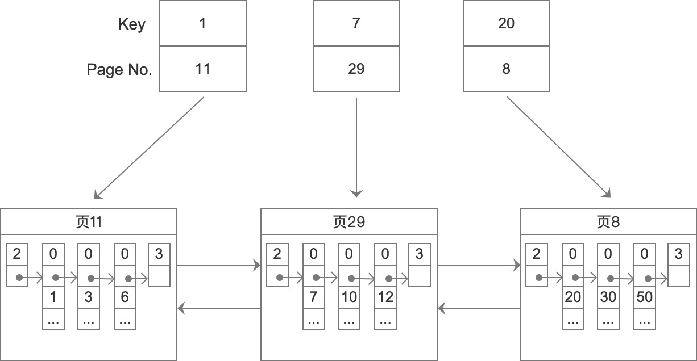
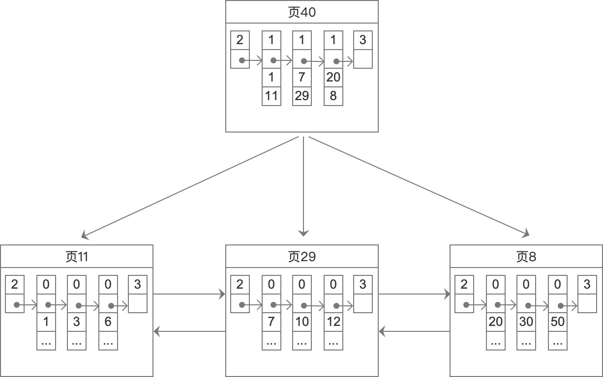
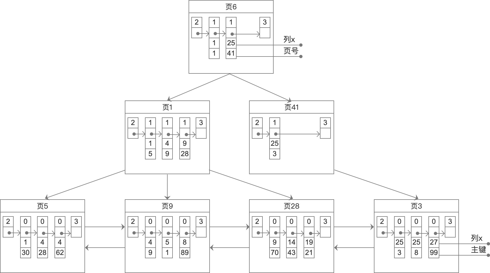

# Mysql的原理

查询执行过程
-------

一条SQL查询语句在Mysql中是如何执行的呢？我们可以通过它的基本结构图看到各个模块在执行过程中起到的作用:

Server层包括连接器、查询缓存、分析器、优化器、执行器等，涵盖Mysql大多数核心服务功能，以及所有的内置函数、跨存储引擎的功能实现(如存储过程、触发器、视图等)。而存储引擎属于插件式架构，支持InnoDB、MyISAM、Memory等多个存储引擎，不同引擎共用一个Server层。

### 连接器
客户端一般通过TCP与服务端建立连接，用户名密码认证通过后，连接器先到权限列表中查出你拥有的权限，之后这个连接里的权限判断逻辑都依赖于此时读取到的，也就是说对这个权限的修改不会影响到已经正在连接的用户。

正在连接的客户端可以这样查看到:

mysql> show processlist;
+----+------+-----------------+---------+---------+------+----------+------------------+
| Id | User | Host            | db      | Command | Time | State    | Info             |
+----+------+-----------------+---------+---------+------+----------+------------------+
|  4 | root | localhost       | awesome | Query   |    0 | starting | show processlist |
|  7 | root | localhost:58134 | boss    | Sleep   |    3 |          | NULL             |
|  8 | root | localhost:58135 | NULL    | Sleep   |    2 |          | NULL             |
+----+------+-----------------+---------+---------+------+----------+------------------+
3 rows in set (0.00 sec)

Command列中显示为Sleep就表示该连接当前是空闲的，如果连接空闲太长时间就会被连接器自动断开，默认是8小时，可通过`wait_timeout`控制。

### 查询缓存
大多数情况下，我们往往不使用查询缓存，因为它是弊大于利的。它的失效非常的频繁，只要对一个表有更新，这个表上的所有查询缓存都会被清空。对于更新压力大的数据库来讲，查询缓存的命中效率很低。

Mysql8.0以上版本直接将该功能删掉了，所以我们的结构图上也只是把它画成一条支线。

### 分析器
词法分析就是根据一些关键词判断出你要做什么，例如`select`表示这是一个查询语句。那么接下来就会把字符串`T`识别为表名`T`，字符串`ID`识别为列名`ID`。

接着进行语法分析，就是判断输入的语句是否满足语法规则。语法错误的提示就是在这个阶段触发的，例如`You have an error in your SQL syntax`。

### 优化器
优化器是在表里有多个索引的时候决定使用哪个索引；或者有多表关联的时候决定各个表的连接顺序。例如`select * from t1 join t2 using(id) where t1.c=10 and t2.d=20`，就可以有两种处理方式:

* 先从表t1中取出c=10的记录的id，根据id关联到表t2，判断t2中d的值是否为20
* 先从表t2中取出d=20的记录的id，根据id关联到表t1，判断t1中c的值是否为10

这两种方法执行的效率可能不同，优化器就是用来决定使用哪种方案更合理。

### 执行器
执行时，先去判断该用户有没有对这个表的要做的操作的权限，如果没有会返回相应的错误。有权限的话则打开表继续执行，执行器会根据表的引擎定义，使用过这个引擎提供的接口来执行。

InnoDB
-------
`InnoDB`是一个将表中的数据存储到磁盘上的存储引擎，真正处理数据的过程是发生在内存上的，所以需要把数据从磁盘加载到内存中，如果是处理写入或更新时，还需要把内存中的内容写回磁盘中。`InnoDB`将数据划分为若干个页，每页大小为16KB，**以页做为硬盘和内存交互的基本单位**，一般情况下，每次至少会读取或写回16KB的内容。

### 数据页
这些页有很多的种类，例如存放空间头部信息的页、存放日志信息的页等等。我们先来了解存放记录的页，也就是数据页，官方称为**索引页**。

数据页被分为7个部分，有的部分占用固定大小的空间，有的不固定:

|名称|中文名|占用空间|简单描述|
|:--:|:--:|:--:|:--:|
|`File Header`|文件头部|`38`字节|页的一些通用信息|
|`Page Header`|页面头部|`56`字节|数据页专有的一些信息|
|`Infimum + Supremum`|最小和最大记录|`26`字节|两个虚拟的行记录|
|`User Records`|用户记录|不确定|实际存储的行记录内容|
|`Free Space`|空闲空间|不确定|页中尚未使用的空间|
|`Page Directory`|页面目录|不确定|页中的某些记录的相对位置|
|`File Trailer`|文件尾部|`8`字节|校验页是否完整|

在⻚的7个组成部分中，我们自己存储的记录会按照我们指定的行格式存储到User Records中。但在一开始生成⻚的时候，其实并没有User Records这个部分，每当我们插入一条记录，都会从Free Space中申请一个记录大小的空间划分到User Records，当Free Space的空间全部被替换掉后，也就意味着这个⻚使用完 了，如果还有新的记录插入的话，就需要去申请新的⻚了。

每条记录的头信息中有一个`next_record`属性，从而使页中的数据串联成一个单链表，链表中的各个节点按主键的值由小到大连接起来。Innodb会把这些记录分成若干个不同的组，每组的最后一条记录的地址偏移量会存放在`Page Directory`中，这样通过主键在一个页中查找到一条记录就会非常的快，首先通过二分法查到它应该在哪个组中，接着遍历这个组找到相应的记录。

`File Header`主要存了上一页和下一页的编号，使得所有的数据页构成一个双向链表。而`File Trailer`会加入一些效验值，以保证从内存至硬盘同步数据的完整性。

### 行格式
每条用户记录在磁盘上的存放方式也被称为**行格式**或**记录格式**，行格式被分为四种，即`Compact`、`Redundant`、`Dynamic`和`Compressed`。它们原理上大体相同，所以我们以Compact格式为例来详细了解一下。

如图所示，每条记录被分为两个部分，记录的真实数据和记录的额外信息。

Mysql支持一些变长的数据类型，如VARCHAR、各种TEXT、各种BLOB等类型，对于这类变长字段，除了存放它们真正的数据内容，还需要存它们占用了多大空间，在Compact中，会把它们占用多大空间按列的逆序存放在每条记录的头部。所以第一部分就是变长字段长度列表，它只存非NULL值的变长字段的列，如果表中没有变长字段，那就没有这一部分。但是如果当前表采用的字符集是变长字符集，那么对于CHAR类型的字段所占用的空间也会被加入到变长字段长度列表中。

为了让NULL值不占用过多的空间，Compact把NULL值的列统一管理在一个地方。它首先会统计表中哪些列允许有NULL值，即忽略掉主键列和被`NOT NULL`修饰的列；其次将这些统计出来的列逆序的对应一个个二进制位，每位为1时就代表这列当前的值为NULL。同样的，若表中没有允许存储NULL的列，那么这部分也不存在。

而记录的头信息都是一些二进制位，共计40位:

|名称|大小(bit)|描述|
|:--:|:--:|:--:|
|`预留位1`|`1`|没有使用|
|`预留位2`|`1`|没有使用|
|`delete_mask`|`1`|标记该记录是否被删除|
|`min_rec_mask`|`1`|B+树的每层非叶子节点中的最小记录都会添加该标记|
|`n_owned`|`4`|表示当前记录拥有的记录数|
|`heap_no`|`13`|表示当前记录在记录堆的位置信息|
|`record_type`|`3`|表示当前记录的类型|
|`next_record`|`16`|表示下一条记录的相对位置|

对于记录的真实数据部分，Mysql会为每条记录默认的添加一些列，也就是隐藏列，包括:

|列名|是否必须|占用空间|描述|
|:--:|:--:|:--:|:--:|
|`DB_ROW_ID`|否|`6`字节|行ID，唯一标识一条记录|
|`DB_TRX_ID`|是|`6`字节|事务ID|
|`DB_ROLL_PTR`|是|`7`字节|回滚指针|

对于主键，优先使用用户定义的，如果未定义则选取一个`Unique`键作为主键，如果没有`Unique`键则会添加一个`DB_ROW_ID`的隐藏列作为主键，所以这个隐藏列可能不存在。

之前提到一个数据页只有16KB，也就是16384字节，而VARCHAR、CHAR、TEXT、BLOB等字段都有可能大于它，这就造成了一个页存放不了一条记录的情况。我们把这种现象称为行溢出。对于这种情况，Compact会在记录的真实数据部分只存储这条记录的一部分，剩余的数据分散在其他的页中，然后真实数据部分还有20个字节指向这些页的地址。Dynamic、Compressed的行格式和Compact很像，只是在处理行溢出时有些不同罢了，它们只在记录的真实数据处存其他页面的地址，数据都在其他页面。Compressed采用压缩算法对页面进行压缩以节省空间。Mysql5.7默认的行格式就是Dynamic，Redundant属于Mysql5.0之前的快被淘汰的格式。

### 数据目录
InnoDB、MyISAM这样的存储引擎会把数据存储在硬盘上的数据目录中，它不是安装目录，可通过如下命令查看:

mysql> SHOW VARIABLES LIKE 'datadir';
+---------------+-----------------------+
| Variable_name | Value                 |
+---------------+-----------------------+
| datadir       | /usr/local/var/mysql/ |
+---------------+-----------------------+
1 row in set (0.00 sec)


在这个目录中，我们每新建一个新的数据库，Mysql会帮我们创建一个同名的文件夹，并在该文件夹内创建一个`db.opt`的文件，它包含了这个数据库的属性，例如数据库的字符集和比较规则等。之后我们在某数据库创建一个表时，Mysql会为我们创建一个`表名.frm`的文件，它存储了表结构的定义；InnoDB会为我们创建一个`表名.ibd`的文件，它是一个独立的表空间文件，存储了一页页的数据。

Mysql有四个系统库，但information_schema库被特殊对待，没有相应的文件夹，它保存着MySQL服务器维护的所有其他数据库的信息，比如有哪些表、哪些视图、哪些触发器、哪些列、哪些索引，都是一些元数据；mysql库存储了MySQL的用户账户和权限信息，一些存储过程、事件的定义信息，一些运行过程中产生的日志信息，一些帮助信息以及时区信息等；performance_schema库主要保存MySQL服务器运行过程中的一些状态信息，算是对MySQL服务器的一个性能监控，包括统计最近执行了哪些语句，在执行过程的每个阶段都话费了多⻓时间，内存的使用情况等；sys库主要是通过视图的形式把information_schema和performance_schema结合起来，让程序员可以更方便的了解MySQL服务器的一些性能信息。

此外，默认情况下，InnoDB还会在该目录下创建`ibdata1`这样一个文件，表示系统表空间。MySQL5.5.7到MySQL5.6.6之间的各版本，表中的数据都会被默认存储到这个系统表空间。该目录下还包含服务器进程文件，服务器日志文件，自动生成的RSA、SSL证书和密钥文件等。

Mysql的视图是虚拟表，也会在对应的库文件夹下创建一个frm文件存储。

### 表空间

索引
-------

在没有索引的情况下，我们无法快速定位到数据所在的页，只能从第一个页沿着双向链表依次向下找每个页，在每个页中如果查找的不是主键，还得依次去比对每条记录。显然，这种查询效率是非常低的。

### 聚簇索引
我们先来考虑一种简单的索引方式，先把页的结构简化来看。

数据页中我们暂时认为每页存储三条记录就满了，每条记录我们只关注record_type，0表示普通记录，2表示最小记录，3表示最大记录，以及next_record表示下一条记录。

接下来对于数据的增删改操作，我们必须通过一些诸如记录移动的操作来始终保证这个状态一直成立:**下一个数据⻚中用户记录的主键值必须大于上一个⻚中用户记录的主键值**。这个过程称为**⻚分裂**。有了这个状态的保证，我们可以给每个页建立一个目录项，每个目录项包括其对应的页号以及页中用户记录的最小的主键值，大概是这样的:

这形成了一个简单的索引方案，我们把这些目录项放到一个数组中，当通过主键查找时就能通过这个数组找到对应的数据页，在根据数据页的Page Directory和二分法就可以迅速找到记录。

这个方案的问题是我们需要一段连续的物理空间来放这个存储目录项的数组，但Mysql只能保证页的数据是连续的，即16KB的连续空间。随着表中的数据越来越多，多到16KB根本放不下这些目录项怎么办？另一个问题是如果我们删除数据记录使得某一页中没有内容，那么这页就没必要存在，那么这页对应的目录项也没必要存在，把目录项删除后其后的目录项都得向前移动一下，这显然不是好的设计。

因此InnoDB复用了数据页来存储目录项，每条记录就是一个目录项，只不过这条记录的record_type是1，表示这是一条目录项记录，现在变成了这样:

如果一个目录页放满了，就新增一个目录页，同时在其上再加一层目录页记录这两个目录页。这种数据组织方式就是**B+树**。

这种组织方式有两个特点:

1、使用记录主键值的大小进行记录和⻚的排序，这包括三个方面的含义:

* ⻚内的记录是按照主键的大小顺序排成一个单向链表
* 各个存放用户记录的⻚是根据⻚中用户记录的主键大小顺序排成一个双向链表
* 存放目录项记录的⻚分为不同的层次，在同一层次中的⻚是根据⻚中目录项记录的主键大小顺序排成一个双向链表

2、B+树的叶子节点存储的是完整的用户记录，即记录中包含了所有列的值。

我们把符合这两个特点的B+树称为**聚簇索引**，InnoDB会自动为我们创建聚簇索引，而由于所有的记录都在叶子节点上，也就是所谓的**索引即数据，数据即索引**。

### 二级索引
上面的聚簇索引只在搜索条件是主键是才起作用，如果以别的列为搜索条件又怎么办呢？我们可以多建几颗B+树。效果如图所示:

这颗B+树假设我们以x列去建立索引，那么每个数据页内的记录就是按照x列的大小顺序排列的，和上面的类似，不同的是这条记录只有一个x列的值和其对应的主键的值。所以，当我们去按x=3这样的搜索条件查找数据时，就会先根据这颗新的B+树确定x=3时对应的主键是什么，在根据主键去聚簇索引中查找到完整的一条记录。这个过程也被称为**回表**。`二级索引(Secondary index)`这个名称也正是因为需要两颗B+树，操作两次。

我们观察到上图中存储目录项的记录只包含了x的值和页号，实际上这在二级索引中会存在bug，有可能很多条记录中x的值都是相同的，此时再插入一条记录就不知道要插在哪个位置了。因此这颗B+树中叶子节点每条记录是x的值和主键的值，x相同则按主键大小顺序排列，目录项节点的每条记录是x的值、主键的值、页的号码，x相同时也可按主键排序。

### 联合索引
联合索引就是同时以多个列作为排序规则，比如列x和列y的联合索引就是先以x为排序依据，x相等时以y作为排序依据。只需要根据二级索引的B+树稍作改造即可，每条记录存放x、y和主键的值即可。

### 使用场景
哪些情况能用到索引，哪些情况无法用到呢？我们通过一个例子来看:

CREATE TABLE person_info(
    id INT NOT NULL auto_increment,
    name VARCHAR(100) NOT NULL,
    birthday DATE NOT NULL,
    phone_number CHAR(11) NOT NULL,
    country varchar(100) NOT NULL,
    PRIMARY KEY (id),
    KEY idx_name_birthday_phone_number (name, birthday, phone_number) 
);

先建了一个表，其中有一个自动为主键id建立的聚簇索引，和一个二级索引idx_name_birthday_phone_number，它是由三个列组成的联合索引。如下情况可以使用到索引:

**全值匹配**，当我们的搜索条件中的列和索引中的列一致时，如`SELECT * FROM person_info WHERE name = 'Ashburn' AND birthday = '1990-09-27' AND phone_number = '15123983239';`，若调换name、birthday、phone_number的顺序也是可以使用到索引的，因为Mysql的查询优化器会帮我们优化这种情况。

**匹配左边的列**，在搜索语句中，也可以不包含全部索引的列，只匹配左边的部分列。如`SELECT * FROM person_info WHERE name = 'Ashburn';`是可以用到索引的，搜索条件中的列只要是从联合索引列的最左边开始的、连续的列就能匹配到。

**匹配列前缀**，对于字符串而言，其排序的本质就是比较字符串的大小，一般的规则就是比较逐个字符的大小，也就是说只匹配字符串的前n个字符也是可以用到索引的，如`SELECT * FROM person_info WHERE name LIKE 'As%';`，但若没有从第一个字符开始匹配则用不到索引。有时候我们有匹配字符串后缀的需求，例如某一列是url，其前缀都是www，这种情况我们可以把表中的数据逆序存储，再使用匹配列前缀的方式就可以用到索引了。

**匹配范围值**，当我们需要一个范围的值时也可以用到索引，因为所有记录都是按照索引列的值由小到大的顺序排列的。如`SELECT * FROM person_info WHERE name > 'Asa' AND name < 'Barlow' AND birthday > '1980-01-01';`可以用到name列的索引，但无法用到birthday的索引，因为name查出来的记录中可能并不是按birthday再排序过的。

**精确匹配某一列并范围匹配另外一列**，对于同一个联合索引来说，虽然对多个列进行范围查找时只能用到最左边那个索引列，但如果左边的列是精确查找，则右边的列可以用范围查找，如`SELECT * FROM person_info WHERE name = 'Ashburn' AND birthday > '1980-01-01' AND birthday < '2000- 12-31' AND phone_number > '15100000000';`，name和birthday能用到索引，phone_number无法用到索引。

**用于排序**。如果没有索引的话，我们会把所有的记录加载到内存中，然后通过一些排序算法例如快排等对这些记录排序，如果内存中放不下可能还会借助硬盘中的空间，最后排序完成后再返还给客户端。在Mysql中，把这种在内存中或硬盘中进行排序的方式称为**文件排序(filesort)**，是非常慢的。借助索引可以直接提取出数据，再进行回表拿到其他数据就可以了，例如`SELECT * FROM person_info ORDER BY name, birthday, phone_number LIMIT 10;`。但是，各个排序列的排序顺序要一致，某列asc、某列desc一起混用是无法索引的。另外，用于排序的多个列需要是同一个索引里的，索引列也不能是修饰过的形式，如`SELECT * FROM person_info ORDER BY UPPER(name) LIMIT 10;`。

**用于分组**。其实和排序类似，如`SELECT name, birthday, phone_number, COUNT(*) FROM person_info GROUP BY name, birthday, phone_number`。

### 代价
使用索引在空间和时间上都有代价，每建立一个索引都需要一颗B+树，大的B+树由很多数据页组成，算是不小的存储空间。每次对表进行增、删、改操作时，都可能要修改各个索引。B+树每层节点都是按照索引列的值按从小到大的顺序排序而组成了双向链表。不论是叶子节点的记录，还是内节点的记录都是按照索引列的值从小到大的顺序而形成了一个单向链表。而增、删、改操作可能会对节点和记录的排序造成破坏，所以存储引擎需要额外的时间进行一些记录移位，⻚面分裂、⻚面回收等操作来维护好节点和记录的排序。所以说，一个表上索引建的越多，就会占用越多的存储空间，在增删改记录的时候性能就越差。

此外，回表也是有代价的。二级索引B+树记录在磁盘上的数据是相连的，集中分布在一个或几个数据页中，我们可以很快的把它们读出来，这种读取方式也叫**顺序读取**；读取到之后，其对应的主键并不相连，要读取到完整记录就需要在不同的数据页中去找，这种读取方式叫**随机读取**。需要回表的记录越多，使用二级索引的效率就越低，甚至让某些查询宁愿使用全表扫描也不使用二级索引。比如name值在Asa~Barlow之间的用户记录数量占全部记录数量90%以上，那么如果使用idx_name_birthday_phone_number索引的话，有90%多的id值需要回表，就还不如全表扫描。查询优化器会帮我们判断何时该用全表扫描代替二级索引回表。

### 优化策略
**覆盖索引**，为了避免回表时的损耗，最好在查询列表里只包含索引，如`SELECT name, birthday, phone_number FROM person_info WHERE name > 'Asa' AND name < 'Barlow'`。不鼓励使用`*`号查询列表，最好把需要查询的列依次标明。

**只为用于搜索、排序或分组的列创建索引**，出现在查询列表中的列就没必要索引了。如`SELECT birthday, country FROM person_name WHERE name = 'Ashburn'`只需为name创建索引，birthday和country就不需要了。

**为列的基数大的列创建索引**，列的基数是说该列中不重复的数的个数，比如性别这样的列，其基数也就2个，如果为其建立索引重复的值会特别的多，效果就不会好。

**索引列的类型尽量小**，这里的类型指的是其表示的数据范围，例如整型分为TINYINT、MEDIUMINT、INT、BIGINT几种，在能表示出所需整数的前提下，能用INT就不要用BIGINT。因为数据类型越小，CPU做数字比较时就越快，同时索引占用的空间就越小，一个数据页中就能有更多的记录，缓存在内存中的数据也就越多。这点对于主键来说更是如此，因为二级索引也需要存储主键值。

**索引字符串值的前缀**，也就是说在二级索引的记录中只保留字符串的前几个值，查找时虽不能精确的定位到记录的位置，但能定位到相应前缀的位置，在空间和时间上取得平衡。在字符串类型能存储的值较多的情况下，这种方式是非常鼓励的，如:

CREATE TABLE person_info(
    name VARCHAR(100) NOT NULL,
    birthday DATE NOT NULL,
    phone_number CHAR(11) NOT NULL,
    KEY idx_name_birthday_phone_number (name(10), birthday) 
);

就表示用name的前10个字符来做为索引。但这种方式不能用name列来排序了，如`SELECT * FROM person_info ORDER BY name LIMIT 10;`则用不到索引。

**让索引列在比较表达式中单独出现**，例如`WHERE col * 2 < 4`就用不到索引，但若写成`WHERE col < 4/2`就能用到索引，所以如果索引列在比较表达式中不是以单独列的形式出现，而是以某个表达式，或者函数调用形式出现的话，是用不到索引的。

**让主键自增**。如果主键是自增(AUTO_INCREMENT)的，那我们每插满一个数据页就会去插下一个数据页。而如果插入的主键值忽大忽小，就可能会发生页分裂和记录移动，造成不必要的性能损耗。

**避免冗余重复索引**，这往往发生在某个索引已经被联合索引包含到了，或者对某个列既建立了唯一索引和普通索引。

访问方法
-------

我们平时所写的查询语句本质上只是一种声明式语法，只是告诉MySQL我们要获取的数据符合哪些规则，至于MySQL背地里是怎么把查询结果搞出来的那是MySQL自己的事儿。我们把MySQL执行查询语句的方式称之为访问方法或者访问类型。同一个查询语句可能可以使用多种不同的访问方法来执行，虽然最后的查询结果都是一样的，但是执行的时间可能差距很大。

我们以此表格为例，看看不同的访问方法:

CREATE TABLE single_table (
    id INT NOT NULL AUTO_INCREMENT,
    key1 VARCHAR(100),
    key2 INT,
    key3 VARCHAR(100),
    key_part1 VARCHAR(100),
    key_part2 VARCHAR(100),
    key_part3 VARCHAR(100),
    common_field VARCHAR(100),
    PRIMARY KEY (id),
    KEY idx_key1 (key1),
    UNIQUE KEY idx_key2 (key2),
    KEY idx_key3 (key3),
    KEY idx_key_part(key_part1, key_part2, key_part3)
) Engine=InnoDB CHARSET=utf8;

它有主键id、唯一二级索引key2、普通二级索引key1和key3、联合索引。

### const
当我们可以直接通过主键列或唯一二级索引列来与常数的等值比较来定位到一条记录时，速度是非常快的，这种访问方法称为**const**。例如:`SELECT * FROM single_table WHERE id = 1438;`、`SELECT * FROM single_table WHERE key2 = 3841;`。主键列只需要一次定位，唯一索引列也只需要两次定位。

对于唯一二级索引来说，查询该列为NULL值的情况比较特殊，因为唯一索引并不限制其列为NULL值的数量，所以使用`SELECT * FROM single_table WHERE key2 IS NULL;`查询时不会用const访问方法。