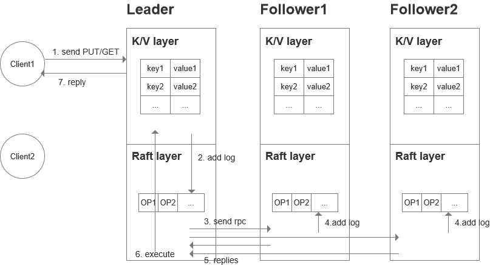
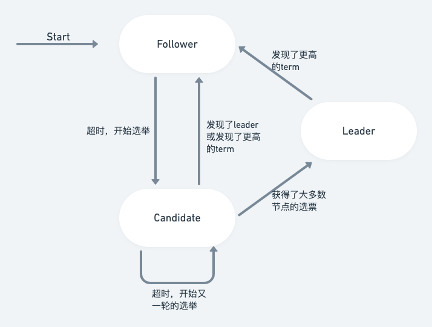

# Raft


概述
-------

对于分布式存储系统，通常会通过维护多个副本来进行容错，提高系统的可用性，那么就带来一个问题，如何维护多个副本的一致性？raft就是解决这个问题的算法。

在一个具有一致性、容错性的集群中，同一时刻所有节点对存储在其中的某个值应该有相同的结果，且当少数节点失效的时候，不影响集群的正常工作，当大多数集群中的节点失效的时候，集群则会停止服务（而非返回一个错误的结果）。

我们以[MIT6.824的lab3](https://pdos.csail.mit.edu/6.824/labs/lab-kvraft.html)中构建的容错键值服务为例，大概看一下基于raft算法的工作流程：



客户端发送Put/Get命令到集群中leader的K/V层，leader会把这个命令先添加到自己的日志中，同时把这个命令通过`AppendEntries`RPC请求发送给自己的follower，并等待绝大多数follower的回复。如果大多数follower(这里也需要算上leader自己)都回复日志已提交，意味着即使失败了这条日志也不会丢失。那么leader就去可以执行这条命令，并把执行结果返回给客户端。在下一次leader发送请求(心跳或任意RPC请求)时，它会把自己已提交该日志(之前只是添加)附加进去，follower才知晓应该去执行这条命令。

#### 为什么需要日志？
日志服务是为了保持状态机(例如上图中的K/V层)的状态：
* 日志可以让所有客户端发送的命令(可能有十个客户端同时发送命令)确定一个顺序，使得各个follower的执行都是统一的顺序，同时也使得leader能够确认各个follower有相同的日志
* follower需要日志来临时存储一条临时的命令，它并不知道是否应该执行，直到它收到leader命令已提交
* 有时候会遇到follower接收不到消息、网络不畅等情况，日志可以帮助leader重新发送
* 当有服务器crash、掉线、重启或者有一个新的服务器加入时，日志可以帮助它重新执行一次完整的命令

leader选举
-------

  
raft节点是在如图所示的三种状态中变换的，但在一个典型的稳态场景中，集群只有一个leader，其他都是follower。尽管我们希望系统一直是这样稳态的运行下去的，但是raft协议的目标就是容错。因此，会花费大量的时间来研究一些非典型的故障场景，如部分服务器崩溃或者断开连接等情况。

**为什么需要一个leader？**  
在一些其他的集群一致性算法设计中，是可以不需要leader的，例如Paxos。但leader可以让raft更高效，每个follower都知道谁是leader，经过一轮消息的传递就可以处理一个事件。效率是最重要的原因，此外也有利于理解等其他原因。

**Raft编排leader的顺序**  
每当有一个新的leader选举出，就会有一个新的term任期。在一个任期内，最多只会有一个leader，或者没有。这个term的值让集群内的服务器知晓谁是当前的leader，而不会去跟随一个被取代了的leader。

**什么时候开始一轮新的选举？**  
每个节点都有一个`Election Timer`倒计时(每次收到消息，重置该时间)，倒计时内没有收到任何消息时，它就会发起一轮选举，当前的任期+1、向其他节点发出投票请求。此时，可能是它自己掉线，产生了一个没有意义的选举，也可能是旧的leader掉线了。

**如何确保每个term至多只有一个leader？**  
首先，必须获得集群中大多数节点的选票才能成为leader。其次，每个节点在当前的term中只能进行一次投票，如果它自己成为了候选人，它就投给自己；如果不是，它就投给第一个发送给它投票请求的节点。所以每个任期内，也至多只有一个节点能得到大多数其他节点的选票，即使在发生网络分裂、部分服务节点掉线的情况下。

**其他节点如何知晓一个新的leader是谁？**  
对于新leader自己，它获得了过半的选票，自然知道自己已经选举成功，但是其他leader是不知道这点的。只有leader能发出`AppendEntries`RPC请求，当follower收到一个更高term的该请求时，它们知道新的leader已经产生，不需要在进行下一轮的选举。

**选举失败**  
选举失败只有两种情况，其一是大部分节点的掉线导致不能拿到大多数的选票；其二是多个候选人同时投票，使得没有人能获得大多数选票。发生失败以后，其实还是会导致`Election Timer`超时，从而term+1，产生新的一轮选举。

**如何避免投票的分散？**  
每个节点会选择一个随机的选举超时，谁的时间先到谁就会先去发起投票请求，接收到请求的节点就会变成follower。这种通过随机延时的方式在网络协议中是很常见的。

**如何选择合适的选举超时时间？**  
这个时间不能太短，至少应该是几倍于心跳超时时间，这样如果网络中偶有丢包的话，可以避免不必要的选举。也需要足够长的时间让候选人在下一轮选举开始前计算出自己是否选举成功。也不能太长，因为在这个时间段，整个系统是没有leader的，也就是说是处于冻结状态无法响应客户端的。

**旧的leader不知道新的leader被选举出怎么办？**  
也许是由于网络波动，旧的leader和少部分节点的网络在处理一部分客户端请求，新的leader和大部分节点的网络在处理一部分客户端请求，旧的leader并不知道新的leader产生，这难道不会造成旧的leader错误的执行？  
旧的leader发出的`AppendEntries`RPC请求只会让少部分节点收到，那么它就不会去提交任何新的日志项目，也就不会去执行命令并返回给客户端。

日志
-------
只要leader存在，客户端只能和leader交互，而无法看到任何follower的状态或日志。那么当leader更替时，会不会出现一些异常？比如说存在两个不同的副本，丢失一些操作，重复一些操作等等。

**在发生crash后日志是如何同步的？**  
假设有三个节点，在某次s3(leader)还没有发送完`AppendEntries`时crash了，那么它们的日志情况可能是这样的:
```
S1: 3
S2: 3 3
S3: 3 3
```
之后，s2在term4被选举为leader并接收到一个客户端请求添加了一条日志后crash，s3在term5发生了同样的事情，会形成这种情况:
```
    10 11 12 13  <- log entry #  
S1:  3  
S2:  3  3  4  
S3:  3  3  5  
```
此时，s3在term6被选举为leader，它如何同步follower的日志？

s3下次发出的`AppendEntries`请求会包含`prevLogIndex=12, prevLogTerm=5, Entries=[log6]`，s2接收到请求以后发现prevLogTerm不匹配，返回false，同样s1也返回false。s3收到返回后，其nextIndex[s2]和nextIndex[s1]的值均减1变为12，下次发出的请求包含`prevLogIndex=11, prevLogTerm=3, Entries=[log5, log6]`，s2会接受这个请求以及相应的日志，删掉自己index12上的log，并返回true。同理，s1最终也会在下一次请求中得到同步。最终所有节点的日志得到同步，nextIndex[s2]和nextIndex[s1]的值变为14。

也就是说，每个follower都会删掉自己尾部和leader不一致的日志项，并从那个不一致的地方开始接受leader的日志，使得其日志和leader同步。

**上例中s2的index为12、term为4的日志被丢掉不会有什么问题吗？**  
是没有问题的，这条日志并没有得到大多数服务器的确认，所以不会被提交，命令也不会被执行。那么有没有可能已经提交的日志项，在被新leader同步时被丢掉呢？实际上leader的选举机制会保证，要选举为leader的节点必须含有全部的已提交的日志。

**为什么不选择日志最长的服务器作为leader？**  
假设有这样一种情况:
```
S1: 5 6 7
S2: 5 8
S3: 5 8
```
这种情况如何产生的呢？比如s1赢得了term6的选举，此时客户端发送一条命令，s1还没有来得及发送给其他节点时就已经crash了。s1很快的重启以后赶上了term7的选举并赢得了这轮选举，它依然收到一条客户端命令后还没发出去就crash，只是这次crash的时间很长。s2当选为了leader，并且应该为term8(因为s1要赢得term7的选举，s2或s3中有一个肯定给它投票了，投票时它的term就已经是7了)。此时s2接到客户端指令，并且也已发送给s3，s2和s3都将log8提交后发生了crash，此时s1也重连了进来。所以，简单的选择日志最长的服务器s1作为leader是不合适的，因为log8已经提交了，那么新的leader只能是s2或s3。

选举规则上，要求了候选人的最后日志项的term更高，或者term相同时，和follower比有更长或者相同的日志，follower才能投票给它。那么在这个例子中，s2和s3不会投票给s1，只会相互投票，其中之一赢得选举。s1的log6和log7将被丢弃，也不会对客户端发送相应的reply，客户端发现指令丢失后会重新发送丢掉的指令。

**如何快速的同步日志？**  
试想一下，在生产环境中，当新的leader产生需要和follower同步日志时，却需要像之前那样通过每次RPC请求向上回滚一个日志项来进行同步，该有多慢？

有这样一种方案能够解决(可能还有更好的方案)，它把同步分为以下三种情况:
```
# CASE 1:
S1:  4  5  5
S2:  4  6  6  6

# CASE 2:
S1:  4  4  4
S2:  4  6  6  6

# CASE 3:
S1:  4  
S2:  4  6  6  6
```
leader S2赢得了term6的选举，它仍然需要发送`AppendEntries`请求，包含`prevLogTerm=6`。此时follower S1如果拒绝了这次请求，还需要附上参数`XTerm`表示冲突日志项的term，以及`XIndex`表示这个term的第一个index，`XLen`为日志的长度。

对于case1，s1发送的参数包含`XTerm=5`，leader发现自己没有这个XTerm，则把nextIndex设为XIndex即可；对于case2，s1发送的参数包含`XTerm=4`，leader发现自己有这个XTerm，则把nextIndex设为自己日志中该term的最后一个日志项的index；对于case3，s1的日志长度过短，nextIndex为XLen。

持久化
-------

**当一个服务器节点崩溃之后会发生什么？**  
raft能够继续工作，但崩溃的节点需要尽快的重新加入进来，否则更多的节点崩溃直至集群中大多数节点都挂掉就会导致集群无法工作。  
有两种重新加入的策略，要么替换为一个新的服务器，这需要传输整个log(或快照)给新的服务器，会很慢，通常发生在崩溃的节点无法恢复；要么重新启动崩溃的服务器，携带必要的信息，重新加入raft网络中继续工作。我们先来讨论第二种策略。

**如果一个服务器重启后重新加入，哪些信息是必须的？**  
根据raft论文中的描述，有`log[]`,`currentTerm`,`votedFor`这三个信息是必须的，这些信息应该存储在硬盘、SSD、带有电池的内存等设备中，且在每次修改时都需要保存一次。  
为什么需要`log[]`？log是raft中唯一用来记录app状态的，当服务器重启后用来恢复应用状态的就是存储在log中的一条条按顺序执行的命令。如果节点属于某次确认日志提交的大多数节点之一，那么重启后应当记住这点，用来保证任一未来的leader都能确认这条提交的日志。  
为什么需要`voteFor`？防止某个server投票给候选人A后崩溃重启，此时又接到候选人B发来的投票请求，导致相同term中既投给了A又投给了B，最终发生同一个term多个leader的情况。  
为什么需要`currentTerm`？确保term是一直增加的，因此每个term中至多有一个leader，它能检测到过时的leader和候选人的RPC消息。  

**不去持久化`commitIndex`,`lastApplied`等信息正确吗？**  
这是可以的，因为崩溃重启并重新加入集群后，一旦收到当前leader发送的`AppendEntries`请求，leader就会告诉它正确的`commitIndex`。而`lastApplied`需要从0开始，因为论文中的raft算法是假定了应用本身不会保存任何持久化状态，需要通过重新执行每条日志中的指令来重新创建它的状态，这样效率是非常低的，使用快照机制并仅执行尾部的一些日志可以显著的提升效率。

**持久化的性能瓶颈**  
持久化通常是性能的瓶颈，因为一次数据写入硬盘的操作需要10ms，SSD也需要0.1ms，所以持久化就限制了我们每秒钟只能处理100个操作（SSD则是10000个，另一个瓶颈是局域网RPC，每次需要小于1ms的时间）。也有一些方式能够解决这个瓶颈，例如一些新的日志项是批量写入硬盘的、使用带有电源的内存设备等。

日志压缩和快照
-------

随着服务的运行，日志会变得越来越大，而且有的日志在raft层是多条，但在应用层可能只是一条，例如`x=1`、`x=2`在raft中是两条日志，但在K/V数据库应用中只会有`x=2`。那么当服务器节点重启或者有新的节点加入，重头执行一遍日志势必会造成大量的时间浪费。

**如何解决？**  
解决方案就是服务器应用层定期的创建快照，快照就是一部分日志执行后的服务器应用层状态机，然后把快照存储在持久性设备上(硬盘)，快照会记录最后一条用于创建快照的日志索引并告诉raft层，已经用于创建快照的日志就可以在任意时刻丢掉。

**服务器崩溃重启之后怎么做？**  
重启后应用层从硬盘中读取快照，raft层从硬盘中读取日志，然后应用层告诉raft层最后一条用于创建快照的日志索引以避免重复执行日志中的命令。  
那么就有一种特殊情况了，follower的最后日志索引是可能高于leader的，因为follower掉线以后，leader建立了快照并丢弃了一部分日志，丢弃之后leader的nextIndex[i]将变为leader日志的起始位置，所以leader通过`AppendEntries`已经不能修复这种情况，因此才有了`InstallSnapshot`RPC请求。

线性一致性
-------

在一个分布式系统中，有很多复杂的情况，比如并发、复制、RPC重传、Leader变化等等，如何保证客户端的读写行为是正确的？线性一致是最常见的、最直观的定义，使之看起来像在单个服务器运行一样。

那么怎样达成线性一致性呢？针对于所有的操作，我们能把它们和时间线匹配上，并且读取得到某个值时，之前是发生过该值的写入操作而没有被覆盖掉的。例如:  


`Wx1`表示客户端A写入x的值为1，`Rx1`表示客户端B读取x的值得到1。对于某条线段，例如`Wx1`，它的起点表示客户端发起请求，终点表示服务端返回的时间点，但是本身的读取、写入这些操作在服务器上的执行时间是很短的，相对于整个请求可以认为是瞬间完成，那么就可以认为是在时间轴上的一个点，这个点既可以在线段的最前面，也可以在最后面。我们可以从图2中看到x值的变化。

对于图1，我们可以找到这样一个顺序，Wx1->Rx1->Wx2->Rx2，它符合值的约束(写入发生在读取之前)，以及实时操作的约束(先是Wx1然后Wx2)，所以它是符合线性一致的。再来看一个例子:
```
  |-Wx1-| |-Wx2-|
    |--Rx2--|
              |-Rx1-|
```
这个例子中，要实现Wx1->Rx1->Wx2->Rx2这样的顺序是不可能的，因为基于实时性约束，Rx2结束了才会发生Rx1，所以它是非线性一致的。
```
|--Wx0--|  |--Wx1--|
            |--Wx2--|
        |-Rx2-| |-Rx1-|
```
这个例子我们也能找到一个顺序，Wx0->Wx2->Rx2->Wx1->Rx1，所以它是线性一致的。
```
|--Wx0--|  |--Wx1--|
            |--Wx2--|
C1:     |-Rx2-| |-Rx1-|
C2:     |-Rx1-| |-Rx2-|
```
这个例子中，先是Wx2->C1的Rx2->Wx1->C1的Rx1和C2的Rx1，此时C2需要得到Rx2，则又需要Wx2，形成了一个循环，因此它不是线性一致的。也就是说对于服务端，可以选择任一顺序进行并发写入，但对于所有的客户端，它们看到的写入顺序应该是一致的，这点是很重要的。
```
|-Wx1-|
        |-Wx2-|
                |-Rx1-|
```
这个例子只有一种执行顺序，即Wx1->Wx2->Rx1，但读到Rx1显然不可能，所以说明读取必须返回最新的数据，旧的数据是非线性一致的。
```
C1: |-Wx3-|          |-Wx4-|
C2:          |-Rx--------------|
```
现在假设C2在发送出一个读取请求的时候，服务端回复的消息丢失了，过了一段时间它重新发送，服务端看到重复的读取请求返回了第一次的结果，此时Rx3是线性化的，虽然它是一个陈旧的数据。

RPC重复的情况
-------

**当客户端发起的Get/Put的RPC请求超时会发生什么？**  
如果服务器已经挂掉了或者请求丢掉了，那么重新发送没有问题，但还有情况是服务器已经执行了，返回给客户端的请求丢掉了，这个时候如果客户端重新发送是非常危险的，因为可能造成服务端执行两次而得到错误的结果。

**如何解决？**  
为了解决这样的问题，我们需要对重复的RPC请求进行检测。我们给每个请求分配一个ID，如果客户端发现超时而重新发送的请求使用相同的ID。服务端需要维护一个表，以这个ID为索引，把每个RPC请求的结果也放进去，如果发现了相同的ID，就可以直接把结果返回。

**什么时候可以删除表中的条目？**  
为了让表尽可能的小，我们可以把表中每条记录对应每个客户端，而非每条RPC请求。每个客户端同时只能有一个未完成的RPC请求，我们给每个客户端一个ClientID，它发出的请求带一个序号Seq。对于每个请求先检测表中有没有ClientID的记录，有的话就去比较Seq，当请求中的Seq更大时才去执行raft中的Start()方法，在raft中的每条Log也记录上ClientID和Seq，这样当applyCh中出现记录时，再把新的Seq更新至表中。

**如果一个新的leader接手，怎么把表传给它？**
所有的follower节点都应该在执行更新时自身维护一份该表，所以不存在传的问题，如果变为leader本身就有。

**如果服务器崩溃，如何恢复该表？**
如果没有快照，重新执行日志时会运行并计算出该表。如果有快照，快照中应该保存一份该表。