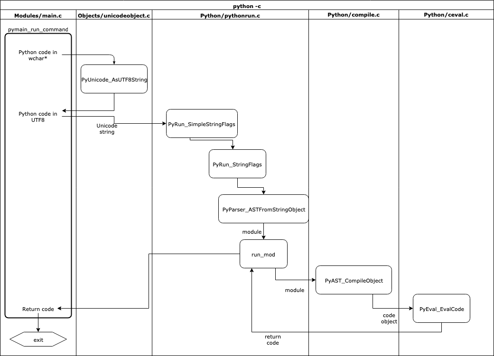
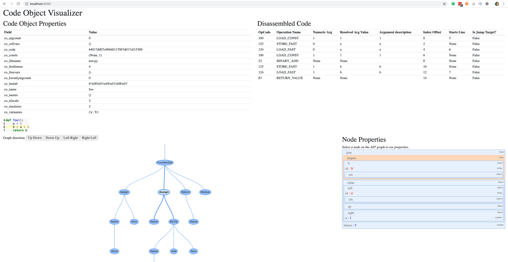
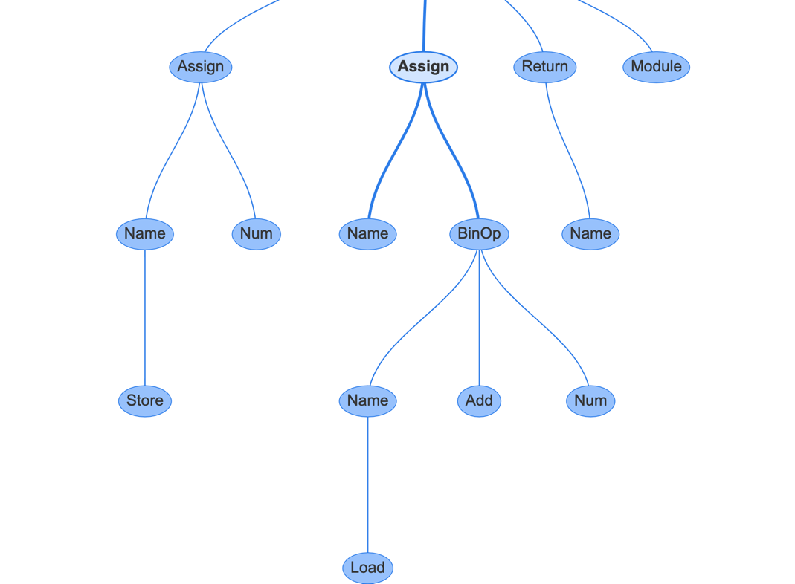

# CPython解释器

字节码
-------
Python中的字节码并不能被CPU执行，而是由栈式虚拟机执行，每条指令的背后都对应了一大堆C实现的机器指令。

字节码被存储在代码对象(即`__code__`)的`co_code`中，以一个函数为例:

>>> def add(x, y):                                                                                          
...     z = x + y
...     return z

>>> " ".join(str(b) for b in add.__code__.co_code)
'124 0 124 1 23 0 125 2 124 2 83 0'

字节码中每两个数字为一组，第一个为指令，第二个为参数，指令对应的二进制数可以在CPython源码中找到:

<!-- cpython/Include/opcode.h -->
#define BINARY_ADD               23
#define RETURN_VALUE             83
#define LOAD_FAST               124
#define STORE_FAST              125

这就可以和dis的输出结果对应起来:

>>> dis.dis(add)
<!-- 源码行    偏移量 指令           参数(目标对象)  -->
  2           0 LOAD_FAST                0 (x)
              2 LOAD_FAST                1 (y)
              4 BINARY_ADD
              6 STORE_FAST               2 (z)

  3           8 LOAD_FAST                2 (z)
             10 RETURN_VALUE

指令所对应的源码行这个信息其实保存在代码对象的两个相关属性中，`co_firstlineno`用来存储该段代码起始的行号，`co_lnotab`由每两个数字一组组成，前一个为字节码偏移的位置，后一个为相对前一组行号的增量。每条字节码指令代表的意义可通过官方文档[此处](https://docs.python.org/3/library/dis.html)查询到。

GIL
-------
全局解释器锁机制使得解释器在同一时刻仅有一个线程可以被调度执行，某个线程若想要执行，就先要拿到GIL，但在每个Python进程中，只有一个GIL。它的存在使得解释器本身的实现更简单一些，更容易实现对象的安全访问，便于进行内存管理和编写扩展。但在多核环境下无法实现并行，对于以多线程为基础的并发应用就是一个灾难。

对于IO密集型任务，线程是在发生阻塞时主动释放GIL的，让其他线程得以执行。而对于CPU密集型任务，采取超时策略。

当GIL被其他线程占用时，等待线程会阻塞一段时间。如果超时（默认为0.005秒）后，依然无法获取锁，则发出请求。这种请求设计的很轻巧，就是一个全局条件变量设置。正在执行的线程在解释循环内会检查该标记，然后释放锁，切换线程执行，其自身进入等待状态。属于典型的协作机制。相关源码:

<!-- cpython/Python/ceval.c -->
main_loop:
    for (;;) {
        if (_Py_atomic_load_relaxed(eval_breaker)) {
            opcode = _Py_OPCODE(*next_instr);
            if (_Py_atomic_load_relaxed(&ceval->gil_drop_request)) {
                /* Give another thread a chance */
                drop_gil(ceval, tstate);

                /* Other threads may run now */
                take_gil(ceval, tstate);

                /* Check if we should make a quick exit. */
                exit_thread_if_finalizing(tstate);

                if (_PyThreadState_Swap(&runtime->gilstate, tstate) != NULL) {
                    Py_FatalError("ceval: orphan tstate");
                }
            }
        }
        switch (opcode) {
          case TARGET(NOP):
          case TARGET(LOAD_FAST):
          ...
        }
    }

CPython使用系统线程，且没有实现线程调度。所以，具体哪个等待线程被切换执行，由操作系统决定。甚至，发出请求和被切换执行的未必就是同一个线程。

对于CPU密集型任务，除了使用多进程架构绕开，也可以使用C来编写多线程的扩展也能绕开GIL限制。

执行过程
-------
### 编码规范
像`PEP8`一样，CPython也有自己的一套编码规范，为[PEP7](https://www.python.org/dev/peps/pep-0007/)，有一些命名规范可以帮助我们更好的阅读源码:

* 使用`Py`前缀的方法为公共方法，但不会用于静态方法。`Py_`前缀是为`Py_FatalError`这样的全局服务性函数保留的，对于特殊的类型(比如某类对象的API)会使用更长的前缀，例如`PyString_`都是字符串类的方法
* 公共函数和变量使用驼峰加上下划线，例如PyObject_GetAttr, Py_BuildValue, PyExc_TypeError等
* 偶尔有一些内部的函数，却需要对加载器可见，我们使用`_Py`前缀，例如_PyObject_Dump
* 宏使用驼峰前缀加大写，例如PyString_AS_STRING, Py_PRINT_RAW等

### 执行方式
Python的执行方式有五种:

* 使用`python -c`执行单条语句
* 使用`python -m`执行某个模块
* 通常使用的运行某个文件
* 使用shell的管道连接，将`stdin`的内容作为python的输入
* 使用交互式命令行环境(REPL)

通过这三个文件，我们能观察到一个整体的执行过程:

1. Programs/python.c，一个简单的最初的程序入口
2. Modules/main.c，把整个执行过程的抽象打包再一起，包含加载环境信息、执行代码和清理内存
3. Python/initconfig.c，从系统中加载环境变量等信息，以及命令行中的参数等


<!-- cpython/Programs/python.c -->
int main(int argc, char **argv)
{
    // unix平台是_Py_UnixMain，windows平台是Py_Main
    return _Py_UnixMain(argc, argv);
}


然后是选择执行模式:

<!-- cpython/Modules/main.c -->
int _Py_UnixMain(int argc, char **argv)
{
    return pymain_main(&pymain);
}

static int pymain_main(_PyMain *pymain)
{
    pymain_init(pymain);

    int res = pymain_cmdline(pymain);
    if (res < 0) {
        _Py_FatalInitError(pymain->err);
    }
    if (res == 1) {
        goto done;
    }

    pymain_init_stdio(pymain);
    // 初始化
    pymain->err = _Py_InitializeCore(&pymain->config);

    // 执行逻辑
    pymain_run_python(pymain);

    if (Py_FinalizeEx() < 0) {
        pymain->status = 120;
    }

done:
    // 退出清理
    pymain_free(pymain);

    return pymain->status;
}

static void pymain_run_python(_PyMain *pymain)
{
    PyCompilerFlags cf = {.cf_flags = 0};

    pymain_header(pymain);
    pymain_import_readline(pymain);

    // 执行模式选择
    if (pymain->command) {
        // 命令行模式 -c
        pymain->status = pymain_run_command(pymain->command, &cf);
    }
    else if (pymain->module) {
        // 模块模式 -m
        pymain->status = (pymain_run_module(pymain->module, 1) != 0);
    }
    else {
        // 入口文件模式
        pymain_run_filename(pymain, &cf);
    }

    pymain_repl(pymain, &cf);
}


这个流程图能清晰的表达出上述代码:

### 建立运行时环境
通过上图，我们可以看到无论执行任何python代码，运行时首先会建立相关环境。这个环境在`Include/cpython/initconfig.h`中定义为[PyConfig](https://github.com/python/cpython/blob/d93605de7232da5e6a182fd1d5c220639e900159/Include/cpython/initconfig.h#L407)，该结构体中的数据包括:

* 运行模式的标记，比如debug或optimized模式
* 执行的模式，比如是以文件的方式、或者模块的方式、stdin的方式
* 通过`-X <option>`附加的拓展选项
* 运行时设置的环境变量

这些值，我们也可以在运行时中查看到:

[ubuntu] /tmp/missing/tt $ python3 -X dev -q -v
>>> import sys
>>> sys.flags
sys.flags(debug=0, inspect=0, interactive=0, optimize=0, dont_write_bytecode=0, no_user_site=0, no_site=0, ignore_environment=0, verbose=1, bytes_warning=0, quiet=1, hash_randomization=1, isolated=0)
>>> sys._xoptions
{'dev': True}


### 通过输入运行

#### -c的方式
例如`python -c "print('hi')"`，它的运行流程如图所示:

[pymain_run_command()](https://github.com/python/cpython/blob/d93605de7232da5e6a182fd1d5c220639e900159/Modules/main.c#L240)的核心逻辑如下:

// 首个参数就是-c传递的指令
// wchar_t*类型通常是CPython中用于存储Unicode数据的低级存储类型，因为该类型的大小也可以存储UTF8字符
static int
pymain_run_command(wchar_t *command, PyCompilerFlags *cf)
{
    PyObject *unicode, *bytes;

    // 转换为PyUnicode对象
    unicode = PyUnicode_FromWideChar(command, -1);

    // 对unicode进行utf8编码得到一个python字节对象
    bytes = PyUnicode_AsUTF8String(unicode);

    // 重新解码为字符串丢去执行
    ret = PyRun_SimpleStringFlags(PyBytes_AsString(bytes), cf);

    return (ret != 0);
}


而[PyRun_SimpleStringFlags()](https://github.com/python/cpython/blob/d93605de7232da5e6a182fd1d5c220639e900159/Python/pythonrun.c#L453)的目的是创建一个Python模块`__main__`，和一个字典，再将命令一起打包调用[PyRun_StringFlags()](https://github.com/python/cpython/blob/d93605de7232da5e6a182fd1d5c220639e900159/Python/pythonrun.c#L1008)，这个函数将创建一个假的文件名，接着就是调用Python解析器创建AST并返回模块mod了:

int
PyRun_SimpleStringFlags(const char *command, PyCompilerFlags *flags)
{
    PyObject *m, *d, *v;
    // 建立入口模块
    m = PyImport_AddModule("__main__");
    // 创建字典，用于globals()和locals()
    d = PyModule_GetDict(m);
    v = PyRun_StringFlags(command, Py_file_input, d, d, flags);
    return 0;
}

PyObject *
PyRun_StringFlags(const char *str, int start, PyObject *globals,
                  PyObject *locals, PyCompilerFlags *flags)
{
...
    mod = PyParser_ASTFromStringObject(str, filename, start, flags, arena);
    ret = run_mod(mod, filename, globals, locals, flags, arena);
    PyArena_Free(arena);
    return ret;


#### -m的方式
另一种执行Python命令的方式是-m选项和模块名称，例如`python -m unittest`可以运行标准库中的unittest模块。实际上它就是在sys.path中去搜索名为unittest的模块然后去执行。

CPython是先通过一个C的API函数[PyImport_ImportModule()](https://github.com/python/cpython/blob/d93605de7232da5e6a182fd1d5c220639e900159/Python/import.c#L1409)来导入标准库`runpy`，它返回的是一个PyObject核心对象类型，然后需要一些特殊的方法获取它的属性再调用。例如`hi.upper()`相当于`hi.upper.__call__()`，在C中[PyObject_GetAttrString()](https://github.com/python/cpython/blob/d93605de7232da5e6a182fd1d5c220639e900159/Objects/object.c#L831)就是用来获得hi的upper属性，然后通过[PyObject_Call()](https://github.com/python/cpython/blob/d93605de7232da5e6a182fd1d5c220639e900159/Objects/call.c#L214)就是去执行__call__()。


// modname就是通过-m传递进来的参数
static int
pymain_run_module(const wchar_t *modname, int set_argv0)
{
    PyObject *module, *runpy, *runmodule, *runargs, *result;
    runpy = PyImport_ImportModule("runpy");
 ...
    runmodule = PyObject_GetAttrString(runpy, "_run_module_as_main");
 ...
    module = PyUnicode_FromWideChar(modname, wcslen(modname));
 ...
    runargs = Py_BuildValue("(Oi)", module, set_argv0);
 ...
    result = PyObject_Call(runmodule, runargs, NULL);
 ...
    if (result == NULL) {
        return pymain_exit_err_print();
    }
    Py_DECREF(result);
    return 0;
}

这段代码说明`python -m <module>`本质上是`python -m runpy <module>`，module只是参数，runpy对其进行了一层包装。runpy是用纯python写的位于`Lib/runpy.py`，它的目的是抽象在不同操作系统上定位和执行模块的过程，具体干这些事:

* 调用用户提供的模块的`__import__()`方法
* 设置该模块的名字空间为`__main__`
* 在`__main__`的名字空间下执行该模块

runpy模块同样也可以用来执行某个目录或者zip文件。

#### file模式
如果是`python test.py`这种方式，CPython会打开一个文件句柄，然后传递给`Python/pythonrun.c`中的[PyRun_SimpleFileExFlags()](https://github.com/python/cpython/blob/d93605de7232da5e6a182fd1d5c220639e900159/Python/pythonrun.c#L372)方法:

int
PyRun_SimpleFileExFlags(FILE *fp, const char *filename, int closeit,
                        PyCompilerFlags *flags)
{
 ...
    m = PyImport_AddModule("__main__");
 ...
    // 如果是pyc文件，则调用run_pyc_file()
    if (maybe_pyc_file(fp, filename, ext, closeit)) {
 ...
        v = run_pyc_file(pyc_fp, filename, d, d, flags);
    } else {
        // .py和stdin模式都运行PyRun_FileExFlags()
        if (strcmp(filename, "<stdin>") != 0 &&
            set_main_loader(d, filename, "SourceFileLoader") < 0) {
            fprintf(stderr, "python: failed to set __main__.__loader__\n");
            ret = -1;
            goto done;
        }
        v = PyRun_FileExFlags(fp, filename, Py_file_input, d, d,
                              closeit, flags);
    }
 ...
    return ret;
}


而[PyRun_FileExFlags()](https://github.com/python/cpython/blob/d93605de7232da5e6a182fd1d5c220639e900159/Python/pythonrun.c#L1032)和前文介绍的通过-c输入的PyRun_SimpleStringFlags()作用类似，都是去创建AST返回mod然后运行mod:

PyObject *
PyRun_FileExFlags(FILE *fp, const char *filename_str, int start, PyObject *globals,
                  PyObject *locals, int closeit, PyCompilerFlags *flags)
{
 ...
    mod = PyParser_ASTFromFileObject(fp, filename, NULL, start, 0, 0,
                                     flags, NULL, arena);
 ...
    ret = run_mod(mod, filename, globals, locals, flags, arena);
}


[run_mod()](https://github.com/python/cpython/blob/d93605de7232da5e6a182fd1d5c220639e900159/Python/pythonrun.c#L1125)负责把模块发送给AST编译为一个代码对象，即文章开头提到过的存储字节码以及保存在.pyc文件中的对象:

static PyObject *
run_mod(mod_ty mod, PyObject *filename, PyObject *globals, PyObject *locals,
            PyCompilerFlags *flags, PyArena *arena)
{
    PyCodeObject *co;
    PyObject *v;
    co = PyAST_CompileObject(mod, filename, flags, -1, arena);
    v = run_eval_code_obj(co, globals, locals);
    return v;
}

之后的run_eval_code_obj()就属于执行逻辑了，后文中再描述。

[run_pyc_file()](https://github.com/python/cpython/blob/d93605de7232da5e6a182fd1d5c220639e900159/Python/pythonrun.c#L1145)可以理解为省略了创建AST的过程，而是通过marshal把pyc文件中的内容复制到内存并将其转换为特定的数据结构。硬盘上的pyc文件就是CPython编译器缓存已编译代码的方式，因此无需每次调用脚本时再编译一次:

static PyObject *
run_pyc_file(FILE *fp, const char *filename, PyObject *globals,
             PyObject *locals, PyCompilerFlags *flags)
{
    PyCodeObject *co;
    PyObject *v;
  ...
    v = PyMarshal_ReadLastObjectFromFile(fp);
  ...
    co = (PyCodeObject *)v;
    v = run_eval_code_obj(co, globals, locals);
    return v;
}


### 语义解析
在前文中我们了解到在执行时会先去创建AST，那么这步具体是怎么做的呢:

mod_ty
PyParser_ASTFromFileObject(FILE *fp, PyObject *filename, const char* enc,
                           int start, const char *ps1,
                           const char *ps2, PyCompilerFlags *flags, int *errcode,
                           PyArena *arena)
{
    ...
    node *n = PyParser_ParseFileObject(fp, filename, enc,
                                       &_PyParser_Grammar,
                                       start, ps1, ps2, &err, &iflags);
    ...
    if (n) {
        flags->cf_flags |= iflags & PyCF_MASK;
        mod = PyAST_FromNodeObject(n, flags, filename, arena);
        PyNode_Free(n);
    ...
    return mod;
}

在[PyParser_ASTFromFileObject()](https://github.com/python/cpython/blob/d93605de7232da5e6a182fd1d5c220639e900159/Python/ast.c#L772)方法中，会将文件句柄、编译器标志、以及内存块对象打包给[PyParser_ParseFileObject()](https://github.com/python/cpython/blob/d93605de7232da5e6a182fd1d5c220639e900159/Parser/parsetok.c#L163)转换为一个node对象:

node *
PyParser_ParseFileObject(FILE *fp, PyObject *filename,
                         const char *enc, grammar *g, int start,
                         const char *ps1, const char *ps2,
                         perrdetail *err_ret, int *flags)
{
    struct tok_state *tok;
...
    if ((tok = PyTokenizer_FromFile(fp, enc, ps1, ps2)) == NULL) {
        err_ret->error = E_NOMEM;
        return NULL;
    }
...
    return parsetok(tok, g, start, err_ret, flags);
}

该方法把两项重要的任务组合了起来，一是使用[PyTokenizer_FromFile()](https://github.com/python/cpython/blob/d93605de7232da5e6a182fd1d5c220639e900159/Parser/tokenizer.h#L78)实例化一个tok_state，tok_state也只是一个数据结构(容器)，存储由tokenizer生成的临时数据；二是使用[parsetok()](https://github.com/python/cpython/blob/d93605de7232da5e6a182fd1d5c220639e900159/Parser/parsetok.c#L232)将token转换为一个具体的解析树(节点列表)。

在parsetok()中，将循环调用[tok_get()](https://github.com/python/cpython/blob/d93605de7232da5e6a182fd1d5c220639e900159/Parser/tokenizer.c#L1110)方法，该方法像是一个迭代器，不断获取解析树的下一个token，parsetok()在根据不同token设置tok_state中相关的值。它也是CPython中最复杂的方法之一，因为要兼容各种各样的边缘情况、数十年的历史原因、新的语言特性等等原因。我们来看其中一种简单的解析，如何把每行结尾变为token`NEWLINE`的:

static int
tok_get(struct tok_state *tok, char **p_start, char **p_end)
{
...
    /* Newline */
    if (c == '\n') {
        tok->atbol = 1;
        if (blankline || tok->level > 0) {
            goto nextline;
        }
        *p_start = tok->start;
        *p_end = tok->cur - 1; /* Leave '\n' out of the string */
        tok->cont_line = 0;
        if (tok->async_def) {
            /* We're somewhere inside an 'async def' function, and
               we've encountered a NEWLINE after its signature. */
            tok->async_def_nl = 1;
        }
        return NEWLINE;
    }
...
}

parsetok()返回的是一个node节点类型:

typedef struct _node {
    short               n_type;
    char                *n_str;
    int                 n_lineno;
    int                 n_col_offset;
    int                 n_nchildren;
    struct _node        *n_child;
    int                 n_end_lineno;
    int                 n_end_col_offset;
} node;

这些个节点组成的树我们叫CST，每个节点包含了语法、tokenID、符号，但这个树不能用于编译器做出快速决策，编译器需要更高一级抽象即AST，我们可以通过内部的API观察到CST的输出结果:

import symbol
import token
import parser

# 为了输出结果的可读性，做了一层处理
def lex(expression):
    symbols = {v: k for k, v in symbol.__dict__.items() if isinstance(v, int)}
    tokens = {v: k for k, v in token.__dict__.items() if isinstance(v, int)}
    lexicon = {**symbols, **tokens}
    st = parser.expr(expression)
    st_list = parser.st2list(st)

    def replace(l: list):
        r = []
        for i in l:
            if isinstance(i, list):
                r.append(replace(i))
            else:
                if i in lexicon:
                    r.append(lexicon[i])
                else:
                    r.append(i)
        return r

    return replace(st_list)

# 小写的就是符号，大写的就是token
>>> pprint(lex('a + 1'))
['eval_input',
 ['testlist',
  ['test',
   ['or_test',
    ['and_test',
     ['not_test',
      ['comparison',
       ['expr',
        ['xor_expr',
         ['and_expr',
          ['shift_expr',
           ['arith_expr',
            ['term',
             ['factor', ['power', ['atom_expr', ['atom', ['NAME', 'a']]]]]],
            ['PLUS', '+'],
            ['term',
             ['factor',
              ['power', ['atom_expr', ['atom', ['NUMBER', '1']]]]]]]]]]]]]]]]],
 ['NEWLINE', ''],
 ['ENDMARKER', '']]


### AST
CPython的下一个阶段就是将CST转换为能够执行的、更有逻辑的东西，也就是AST(Abstract Syntax Trees，抽象语法树)。虽然这一步是解释器内联生成，我们也有其他办法能方便的观察到，例如使用`instaviz`库，它能在一个网页中展示AST以及每个节点的属性:

>>> import instaviz
>>> def example():
       a = 1
       b = a + 1
       return b
>>> instaviz.show(example)

我们能看到这样的界面:

然后可以点击AST中的节点:

例如如果点击图中的Assign节点，它代表的是`b=a+1`这一行，右侧会展示出这个节点的属性，它有两个属性，一个是targets，代表变量名称，它有时可能是一个列表，因为解包操作就会有多个变量；另一个是value，代表变量的值，在这里就是`a+1`这个表达式。如果我们再点击BinOp节点，就可以看到它的3个属性，left表示运算符左边是什么，op表示运算符，right表示运算符右边。

用C语言编译AST并不是一件容易的事，所以实际上真正的编译模块有5000行代码，在`Python/ast.c`中。

具体到核心代码流程来说，之前通过PyParser_ParseFileObject()得到的CST对象node，接着传入[PyAST_FromNodeObject()](https://github.com/python/cpython/blob/d93605de7232da5e6a182fd1d5c220639e900159/Python/ast.c#L772)，并附带文件名、编译flag和PyArena。得到函数返回的mod_ty，是一个容器结构，属于Python5种模块类型之一:Module、Interactive、Expression、FunctionType、Suite。在`Include/Python-ast.h`中能看到每种类型需要的字段:

enum _mod_kind {Module_kind=1, Interactive_kind=2, Expression_kind=3,
                 FunctionType_kind=4, Suite_kind=5};
struct _mod {
    enum _mod_kind kind;
    union {
        struct {
            asdl_seq *body;
            asdl_seq *type_ignores;
        } Module;

        struct {
            asdl_seq *body;
        } Interactive;

        struct {
            expr_ty body;
        } Expression;

        struct {
            asdl_seq *argtypes;
            expr_ty returns;
        } FunctionType;

        struct {
            asdl_seq *body;
        } Suite;

    } v;
};

除了模块类型，其他的AST类型都列在`Parser/Python.asdl`中，包括statement、expression、operators、comprehensions等等。在该文件中我们能看到类型字段的定义也是用在这里的:

-- ASDL's 5 builtin types are:
-- identifier, int, string, object, constant

module Python
{
    mod = Module(stmt* body, type_ignore *type_ignores)
        | Interactive(stmt* body)
        | Expression(expr body)
        | FunctionType(expr* argtypes, expr returns)


接着，PyAST_FromNodeObject()使用TYPE(n)确定首个CST节点的类型来执行不同的逻辑，如果是文件输入，返回的结果就是Module，eval_input就是Expression，总之是Module, Interactive, Expression, FunctionType中的一种:

mod_ty
PyAST_FromNodeObject(const node *n, PyCompilerFlags *flags,
                     PyObject *filename, PyArena *arena)
{
    ...
    switch (TYPE(n)) {
        case file_input:
            stmts = _Py_asdl_seq_new(num_stmts(n), arena);
            for (i = 0; i < NCH(n) - 1; i++) {
                ch = CHILD(n, i);
                if (TYPE(ch) == NEWLINE)
                    continue;
                num = num_stmts(ch);
                if (num == 1) {
                    s = ast_for_stmt(&c, ch);
                }
                else {
                    ch = CHILD(ch, 0);
                    REQ(ch, simple_stmt);
                    for (j = 0; j < num; j++) {
                        s = ast_for_stmt(&c, CHILD(ch, j * 2));
                    }
                }
            }
            /* Type ignores are stored under the ENDMARKER in file_input. */
            ...
            res = Module(stmts, type_ignores, arena);
            break;
        case eval_input: {
            expr_ty testlist_ast;
            testlist_ast = ast_for_testlist(&c, CHILD(n, 0));
            res = Expression(testlist_ast, arena);
            break;
        }
        case single_input:
            ...
            break;
        case func_type_input:
            ...
        ...
    return res;
}


遍历孩子节点并创建相应的AST语句节点逻辑在[ast_for_stmt()](https://github.com/python/cpython/blob/d93605de7232da5e6a182fd1d5c220639e900159/Python/ast.c#L4512)中，该函数内还需要再根据不同的语句类型调用不同的函数创建节点，都是类似于ast_for_*()，例如`2**4`这样的语句最终能找到ast_for_power()这样的方法。

### 终止
执行完之后，结束之前还要进行一系列的清理操作。

<!-- cpython/Python/pylifecycle.c -->
int Py_FinalizeEx(void)
{
    // 等待前台线程结束
    wait_for_thread_shutdown();

    /* Get current thread state and interpreter pointer */
    tstate = PyThreadState_GET();
    interp = tstate->interp;

    // 调用 atexit 注册的退出函数
    call_py_exitfuncs(interp);

    /* Flush sys.stdout and sys.stderr */
    if (flush_std_files() < 0) {
        status = -1;
    }

    /* Disable signal handling */
    PyOS_FiniInterrupts();

    // 垃圾回收，执行析构方法
    _PyGC_CollectIfEnabled();

    // 释放导入的模块
    PyImport_Cleanup();

    // 执行相关结束函数
    _PyTraceMalloc_Fini();
    _PyImport_Fini();
    _PyType_Fini();
    _PyFaulthandler_Fini();
    _PyExc_Fini();

    // 执行内置类型的结束函数
    PyMethod_Fini();
    PyFrame_Fini();
    PyCFunction_Fini();
    PyTuple_Fini();
    PyList_Fini();
    PySet_Fini();
    PyBytes_Fini();
    PyByteArray_Fini();
    PyLong_Fini();
    PyFloat_Fini();
    PyDict_Fini();
    PySlice_Fini();
    _PyGC_Fini();
    _Py_HashRandomization_Fini();
    _PyArg_Fini();
    PyAsyncGen_Fini();
    _PyContext_Fini();

    /* Cleanup Unicode implementation */
    _PyUnicode_Fini();

    PyGrammar_RemoveAccelerators(&_PyParser_Grammar);

    /* Cleanup auto-thread-state */
    _PyGILState_Fini();

    /* Delete current thread. After this, many C API calls become crashy. */
    PyThreadState_Swap(NULL);
    // 清理解释器和主线程状态
    PyInterpreterState_Delete(interp);

    call_ll_exitfuncs();

    _PyRuntime_Finalize();

    return status;
}
