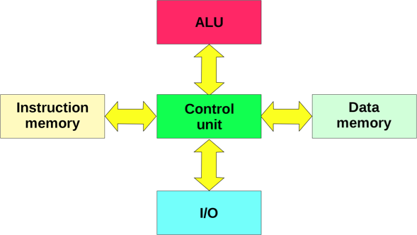
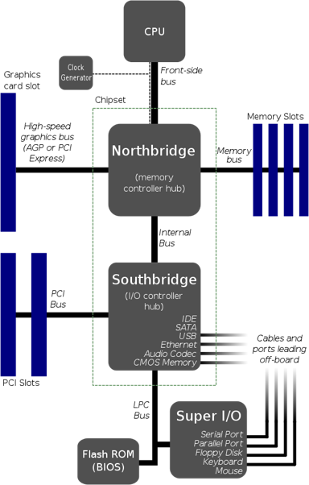
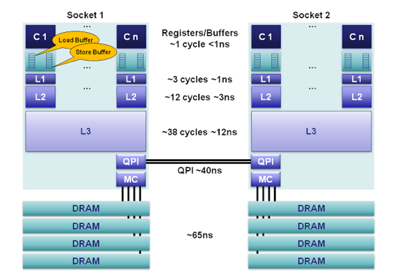
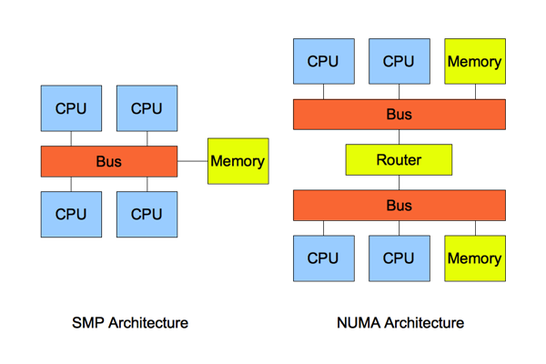
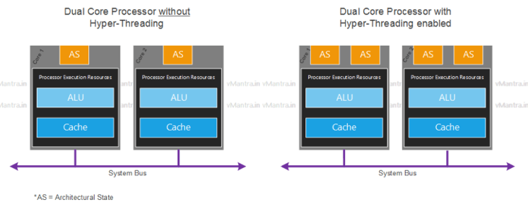

# 计算机科学基础知识之硬件部分

现代计算机体系的基础理论部分仍然是70年代就已经产生的，这些年来一直没有多大突破，只是制造水平和加工工艺在逐步提升。未来除非是量子计算、生物计算等发展成熟，才可能使得计算机基础理论获得革命性突破。

我们在应用软件开发领域，往往非常善于创造包装一些名词，但它们的本质就是那么回事，学习计算机体系的理论有助于我们抓住这些本质。

体系结构
-------
CPU要运行一个程序，它需要指令和数据，指令相当于你要干什么，数据是干这件事所需要的材料。

### 冯诺依曼结构
  
**冯诺依曼结构**就是把指令也当做数据，把指令和数据放在一起。好处就是设计上会简单一些，可以使用一条总线集中存储；另外它还采用了二进制编码的线性地址空间。缺点就是它的数据传输效率远低于CPU的运算效率，因此需要缓存来提升效率。

它的CPU有两套单元：
* **ALU**：算术逻辑单元，实现多组算术和逻辑运算。由与门和或门组成，进行二进制的算术运算，包括加、减、乘、与、或、非、异或。
* **CU**：控制单元，用于程序流程的管理。从内存中取指令放入指令寄存器中分析并执行。

PS：在系统层面上，我们说的内存并不是指物理上的两根内存条，那个叫主存。比如硬盘上的缓存也是内存、打印机上也有缓存等等。

### 哈佛结构
  
**哈佛结构**将指令和数据分开处理，指令和数据拥有不同的总线和地址空间，并行能力非常强，早期的大型计算机就采用这种结构。缺点就是早期电子电路昂贵，成本的问题使得它不适合于通用计算机没有推广开来。
现在纯粹的哈佛结构多用于数字信号处理器(DSP)、单片机等特定领域，它们的指令相对简单也没有缓存。

### 对比总结
实际上现代计算机是对两种架构做了一些折中的。在内存中指令和数据是在一起的，在CPU的L1缓存中，会区分指令缓存和数据缓存，最终执行的时候指令和数据是从两个不同的地方出来的。另外冯诺依曼统一的地址空间也便于我们实现操作系统内存的管理、动态加载程序、JIT等。

总线
-------
我们通常所说的总线未必是电路板上一条条线路，它只是一种方式，可能是软件的，也可能是硬件的，代表了一整套的规范体系。就像高速公路交通网，包括了公路、收费站、加油站、维护人员、交通规则、信号灯指示牌，总线也是一样，除了数据通道，还包括了数据交换方式，比如从何处取(内存)，从哪开始从哪结束有多长，取出来的是数据还是地址等。

现在主流的总线标准为PCI/PCIe，该标准的带宽高，能探测硬件变更，支持热插拔。

### 总线结构
按照不同的传输速度，我们会把总线分开，通过不同的速度来进行分流，使快速的部分拥有更多的流量带宽。北桥芯片处理快速设备，例如CPU、内存、显卡等，南桥芯片处理慢速设备，例如硬盘、网卡等。

  
**前端总线**(FSB)负责CPU与北桥芯片的数据传输，代表CPU与外界数据的通讯速度，相当于CPU能处理的最高能力。而**后端总线**(BSB)负责与CPU内核通讯，其速度高于FSB。现在的芯片集成度越来越高的趋势也正是因为想减少各样的总线来提升各部件之间传输的速度。

中央处理器
-------
**中央处理器**是用来解释指令、处理数据的。编程实质上就是针对CPU而言的。例如我们往硬盘里写一个文件，就要知道文件名称、写在哪个地址、写入的长度等，即使这些工作不全是由CPU完成，CPU至少也要完成其中的调度工作。

### 主频、外频
**主频**是内核工作频率，表达脉冲信号的震荡速度，与CPU的实际运算能力没有直接关系。而**外频**是内核与主板间的同步速度，同时也是内存和主板之间的同步速度。

对现代的CPU而言，衡量其运算速度和性能要看各方面的性能指标，例如缓存、指令集等。很可能出现主频较高的CPU实际运算速度较低的情况。

### 指令集
**指令集**是包含了基本数据类型、指令、寄存器、寻址模式、存储体系、中断和异常处理等打包的一套规范，是CPU真正能够理解的东西。

我们通常分为**精简指令集**(RISC)和**复杂指令集**(CISC)。

典型的复杂指令集就是x86，它的指令特别多，功能丰富，但每条指令的字长不等，也就造成了它需要先读出指令才知道后面的数据/参数有多长，执行速度相对较慢。而有一些虚拟机内会把指令设置为定长的，默认就是两个参数，这样它的缓存亲和性好，效率就高。x86这么设计有一些历史原因，当时还没有CPU缓存的概念。而精简指令集在早期反而是一种高大上的东西，它的指令和寻址方式少，格式统一，并行速度快，主要用于大型机和中高档服务器中。

Intel认为自己定义的x86指令集由于历史原因等不好，于是在64位时代定义了IA-64指令集，但这种指令集和以前的x86并不兼容，它采用了模拟的方式去运行x86，这种方式在当时的windows2000等系统上运行的不好，所以微软持反对态度。此时AMD抓住了机会，它基于原有的386/IA-32标准做了扩充，也就有了现在的x86-64指令集，也可以叫做x64或AMD64。后来，Intel迫于其他厂商的压力，也去使用AMD64指令集，并在后来发展出了兼容的Intel 64，这种指令集和AMD64大部分是相同的。

32位处理器的最大寻址为4GB(2的32次方)，但64位处理器的最大寻址却不是2的64次方。我们知道存储单位的级别从小到大分别为Bytes、KB、MB、GB、TB、PB、EB，每级都等于前一级*1024，所以AMD64理论上可以访问16EB的地址空间，但目前的操作系统只支持到48位，也就是256TB的最大寻址，这种设定的根本原因就是能降低成本。

此外，AMD64里增加了R8-R15的通用寄存器。

### 寄存器和缓存
  
**寄存器**是所有存储体里最快的一个，因为数量少，所以可以直接给每个寄存器取个名字，而无需用地址。

早期，数据由硬盘到内存，再经过前端总线直接到寄存器，因为前端总线传输的效率远低于CPU运算的效率，为了提高性能，我们在CPU内部，寄存器和内存之间增加了一层cache，使得前端总线每次传输更多的内容进入CPU。早期的CPU缓存只有L1，它将指令和数据分开；后来发展至L2，L2不区分指令和数据；再后来多核时代有了L3，能在一个物理处理器的多个核中共享。

缓存只是解决性能问题的一个媒介，它本身有易丢失、易覆盖的特性，不能像寄存器和主存一样当做目标存储器使用。当CPU需要一个数据时，它会先去L1找，找不到则去L2，再找不到去L3找，再找不到就会去系统总线，找到以后批量的传到L3，再把命中的一部分填充至L2，再填充至L1，再返回给处理器。所以L1里有的数据L2、L3肯定有，**每级缓存数据都是下一级的一部分**。

同时，基于**时间局部性**(正在被访问的数据可能近期再次被访问)、**空间局部性**(临近地址数据可能即将被访问)、**顺序局部性**(大部分指令是顺序执行)，可以让缓存有较高的命中率。(PS:我们宏观世界的缓存例如web服务中的memcache往往只是基于时间局部性，因为CPU是针对指令和字节的才去讨论其空间局部性和顺序局部性)。

我们写程序要尽可能的让其缓存亲和性更高，数据连续性更高，比如按一定长度对齐某些数据；对于性能要求高的程序，向操作系统申请锁死主存的一部分，避免被交换到硬盘当中去；甚至对于性能要求极致的场景，可以使用汇编以尽可能的使用寄存器。

  
缓存由多个块组成，每个块我们称为cache line，每行的数据是连续的，每行的大小通常是64字节，行与行之间可能不连续，所以我们对齐数据的时候也是按行来对齐。同时，缓存中有很多的标志位，通过这些标志位去检查缓存是否更新，以决定是否需要置换回内存。

### 多核
在一个处理器内集成多个独立实体物理内核即为**多核**。我们提及Core1、Core2的时候就表示多核，而CPU1、CPU2的时候则是多个CPU。多核能更好的在成本和性能上做出平衡，也不一定比多CPU慢，这主要看软件层面的优化。多核之间可以通过内部的L3缓存进行通讯或数据共享，而多CPU只能通过前端总线或额外建立其他外部通讯机制。

多核架构又分为两种：

  
**对称多处理架构**(SMP)，多用于桌面端。每个处理器(在多核心处理器的例子中，对称多处理架构，将每一个核心都当成是独立的处理器)的地位是平等的，对资源的使用权限相同。好处是体系简单，缺点就是由于只有一个内存控制器，存在资源竞争的问题，一般是通过软硬件锁的机制解决，但随着处理器数量增加访问冲突就会增加，效率就会下降。

**非统一内存访问架构**(NUMA)，是一种为多处理器的电脑设计的内存架构。它将内存分散给多个处理器，处理器访问它自己的本地内存的速度比非本地内存(内存位于另一个处理器，或者是处理器之间共享的内存)快一些。它的扩展性更好，更适用于服务器，针对这种架构去编写程序效率也会更高。

### 超线程
  
对于IO密集型任务，会出现CPU等待时间长的情况。那么**超线程**就是利用特殊的指令，在单个物理核内虚拟出多个逻辑处理器，在指令等待时做别的任务来减少闲置的时间，当然也需要额外的地方(AS，architectural state)保存当前上下文以切换任务。

一般语言里提供的CPU数量都是逻辑处理器的数量，会将超线程虚拟的也算进去。例如python的`multiprocessing.cpu_count()`，或Go的`runtime.NumCPU()`。

超线程多数时候可提升执行效率，但在有些情况下可能会导致性能下降，例如一些CPU密集的场合可能会对垃圾回收器造成负担；或者资源冲突时，依然需要等待，类似于同步锁。

内存
-------
内存严格来说叫**内部存储器**，不止包括物理上的内存条(即主存)，硬盘、打印机等缓存也算作内部存储器。

这里说的是主存，即**随机存取存储器**(RAM，Random Access Memory)，它是与CPU直接交换数据的内部存储器。它可以随时读写，且速度很快，通常做为操作系统的临时数据存储介质。所谓的**随机存取**，是指当存储器的消息被读取或写入时，所需要的时间与这段信息所在的位置无关。

### DRAM
**动态随机存取存储器**。它具有结构简单，空间小，需要刷新的特点，往往被用于作为主存。

**需要刷新**，是指电容器充满电后代表1，未充电的代表0。由于电容器或多或少有漏电的情形，若不作特别处理，电荷会渐渐随时间流失而使数据发生错误。刷新是指重新为电容器充电，弥补流失了的电荷。

**DDR**是指具有双倍数据传输率的SDRAM(动态随机存取存储器)，其数据传输速度为系统时脉的两倍。

### SRAM
**静态随机存取存储器**。它具有结构复杂，成本高，速度快的特点，一个典型的应用就是缓存。

所谓的“静态”，是指这种存储器只要保持通电，里面储存的数据就可以恒常保持。相对之下，DRAM里面所储存的数据就需要周期性地更新。

### 双通道
它在北桥内使用两个内存控制器分别控制一个通道，从而增加寻址和存储带宽，但是由于缓存的存在，并不需要这样的带宽，所以它对性能的提升往往感受不出来。在集成显卡的场景下会有一定帮助，因为集成显卡用内存作为显存，可以专门使用一条通道。

显卡
-------
**显卡**用于转换显示信息，向显示器提供扫描信号。

* 2D芯片处理3D时需要CPU参与，称作**软加速**。
* 3D芯片自己完成，称作**硬加速**。

**GPU**是专门用来执行复杂的数学和几何计算的，它和CPU有什么区别呢？

CPU需要很强的通用性来处理各种不同的数据类型，同时又要逻辑判断又会引入大量的分支跳转和中断的处理。这些都使得CPU的内部结构异常复杂。而GPU面对的则是类型高度统一的、相互无依赖的大规模数据和不需要被打断的纯净的计算环境。GPU的核数远超CPU，被称为众核(NVIDIA Fermi有512个核)。每个核拥有的缓存大小相对小，数字逻辑运算单元也少而简单。

当程序员为CPU编写程序时，他们倾向于利用复杂的逻辑结构优化算法从而减少计算任务的运行时间，即Latency。当程序员为GPU编写程序时，则利用其处理海量数据的优势，通过提高总的数据吞吐量(Throughput)来掩盖Latency。

硬盘
-------
主要的持久化存储媒介。

分为**固态硬盘**(SSD)和**机械硬盘**(HDD)。SSD使⽤非易失性内存NAND Flash存储数据，无须电⼒维持。又分为单层SLC、双层MLC、三层TLC。单层最快，寿命最⻓，成本也最⾼。现在多使⽤MLC，TLC常作为U盘。

其接口又分为SATA和SCSI。SATA是串行ATA，PC的标准接口。SCSI多用于小型机。

其工作模式在BIOS可以设置，早期大多使用**PIO**，即通过CPU执行IO指令读写数据，CPU要持续参与。现在多使用**DMA**，CPU只需要在开始和结束时参与，中间由DMA控制器来完成。

IO
-------
cpu如何访问一大堆的设备？分为PMIO和MMIO。

**PMIO**(Port Mapped I/O)是指端口映射输入输出，早期的时候会把主存和其他设备分开，分别用不同的CPU指令读写。因为使用了不同的地址总线，南桥一些慢速设备的访问不会拖累主存访问的效率。

后来发现这种方式不好，64位时代内存地址空间充裕了就使用了**MMIO**(Memory Mapped I/O)，它把内存地址空间分段，某一段设备用、程序用、操作系统用等，CPU使用相同的指令不同的地址就可操作设备，所有的设备都在监控地址总线，发现自己被访问就通过自身的缓存和MMU建立连接。

BIOS
-------
**基本输入输出系统**，启动后加载的第一个程序。

最早没有操作系统的时候，写的程序就是面向BIOS的，BIOS在完成硬件初始化之后，会去执行硬盘上某个特定扇区的指令，所以只要把程序放在特定位置程序就可以启动。后来操作系统就放在那个位置，我们写的程序面向操作系统。

它向操作系统提供系统参数、引导操作系统，但现代的操作系统比如mac就没有BIOS，而是直接控制硬件。