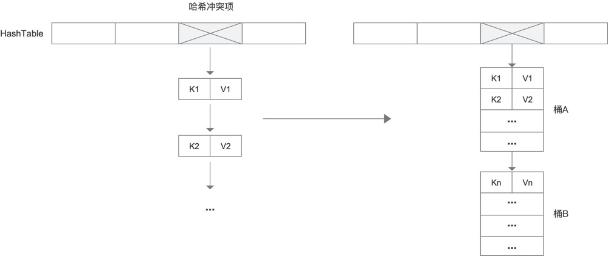

---
hide:
  - toc
---
# 字典

现代编程语言，例如Python和Go中都有字典，其作为一种常见数据结构使用频率非常高。一般作为内置类型，解释器或者编译器都会对其特别的照顾，做相当多的优化，它的设计也需要在通用和性能上找到平衡，当然也是我们非常好的学习案例。

要存储一批数据，我们最先想到的就是用数组，因为它对所有的存储器亲和性是最好的，内存可以看成是一个大的字节数组，CPU cache line也是一个64字节的数组。但数组有个问题，即索引效率低，我们往往是通过排序然后进行二分查找来提高索引的效率。可是如果我们的数据需要频繁的编辑(插入、删除、修改)时，这种排序就可能造成我们需要频繁的对其中的局部进行重排，这时候延伸出了大小堆、树堆等各种各样的结构来解决这些问题。其中有一种数据结构，也就是我们今天要提到的字典(map/dict)，它在各方面效率做到了很好的平衡，它的经典实现方式是hash table，也有很多其它实现方式，但不管是怎样实现的，映射在内存层面仍然是数组，那么它是怎样实现的呢？

首先，我们不考虑value，仅看key是怎么映射到数组上的。数组通过下标数字访问，不管key是什么类型，我们都需要把它通过哈希函数转换为一个数字，若得到的数字很大超过了数组的长度，我们就可以通过取模(n%len)的方式来得到它在数组中的位置。所以任何一个可哈希的Key我们都能把它映射到数组上的某个位置，那么我们就可以把key-value打包为一个struct放在数组中某个位置，解决了高效的查找和编辑的问题。

接下来的问题就是哈希碰撞了。当两个key哈希并取模后的结果是相同的数字时，有一个简单的处理方式就是用链表链起来，即链表法，把一个横向的大的数组转化为了多个纵向的小的链表，Go采用的这种方式。另外一种方法就是若发现冲突，则把新的key加上一个magic_number计算得出一个新的位置，横向的填充到这个空位，称为开放寻址法，Python采用这种方式。

链表法的问题就在于链表的访问效率差，如何优化？当CPU去读取数据时，它会基于空间局部性原则将附近的数据从内存读入L3，然后是L2、L1。那么我们基于这个原则，应当把链表转换为数组，把原有的一个个的item放入一个桶中:

把每8(或8的倍数)个item当做一个桶，一个桶链接另一个桶。当我们需要根据某个查询条件查询数据的时候，我们可以把整个桶拿出来遍历查找，很可能整个桶是被L1或者L3缓存过的，这个访问效率就可能比在内存中去读取快上百倍。

那么针对这个桶是否还有优化空间呢？我们发现遍历的时候是去判断它的key是否相等，并不需要知道它的value。按照当前这种结构value就占用了缓存器的空间:

我们应该尽可能的缓存更多的keys，于是可以把桶分为上下两个部分:

那么还能进一步优化吗？我们发现keys的数据类型不知道，如果是个整数倒还很容易和查询条件做比较，但若是个字符串，两个字符串的比较效率是非常低的。针对这种情况，我们可以再做一层访问拦截:

这层数组放入keys的哈希值，只有当某个位置的哈希值和查询条件匹配时，我们才会去进一步比对keys数组中对应位置的key。这样我们就通过一个整数型数组拦截掉了很多的预判。甚至这个整数数组也无需使用int64，我们只取hashcode的高位构成一个int8类型，[8]int8形成一个64位的数组正好能被一个寄存器存下。

另外这层数组像一个位图，还能用来判断这个桶中还有没有空位，插入数据时先看数组中是否有空位就可以相应的在keys和values中找到空位，删除数据时也不会进行收缩，只是在相应的位置上做标记。

现在，我们经过一层层的优化，字典变成了这个样子:

只要哈希算法分布的很平均，那么基础数组越长，桶的链表就越短，访问效率也越高，这就涉及到一个扩容的问题。随着数据的插入，键值对的总个数和基础数组的长度有一个比例，当这个比例达到一个阈值，就会触发扩容操作。扩容时我们不能直接新建个基础数组，然后把原数组数据一次性搬过去，这种方式会导致某次操作的时间过长使应用卡死。而应该在触发时，设定一个标志，之后对这个字典的每次查询、修改、插入、删除都先去检查这个标志，若标志为真且本次操作的数据在旧字典中，则将它及附近的一段数据都迁移至新字典，这叫​**随机迁移**。同时，为防止每次操作都发生在新字典中，其内部还有个计数器，让其迁移时能够从旧字典的头部再顺序迁移一部分数据，也就是​**顺序迁移**。这样就能保证所有的数据都被迁移过去，迁移完成后，旧字典整个被释放掉。

当删除字典元素时，对于Go这种关注性能的语言，字典的内存不会被压缩，可能会造成内存浪费。如果有大量删除元素的情况，只能新建一个字典，把旧字典的数据手工搬过去，让垃圾回收器回收旧字典。基于这个原因，我们在桶中应该去存储keys和values的内容而不是它们的指针。因为key和value的生命周期是和整个map相同的，不存指针也就意味着减轻了垃圾回收期的压力，原本需要检查回收1(map)+n(keys)+n(values)个对象变为了只需检查1个map对象。所以Go中做了如下设定，如果key和value的长度小于128字节，同时key和value本身不是指针，那么它们会被嵌入到字典内部。

通过以上，我们了解到任何一个看似简单的东西背后可能都隐藏了复杂的设计。